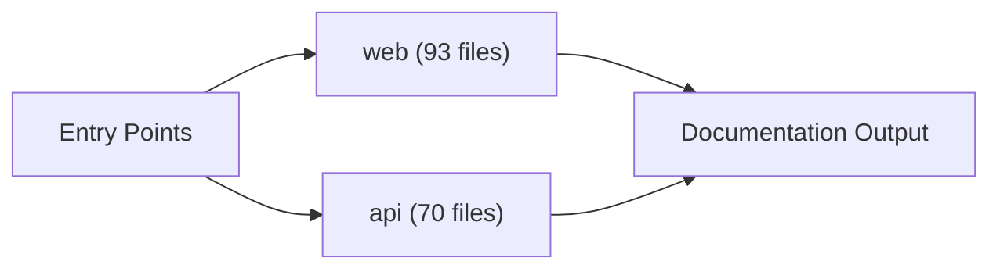

# Immo ME — Documentation

## Project Overview

### Visual Blueprint: Project Tree

Every documented source file is grouped by folder so clients can scan the full project structure in one place.

```project-tree
Immo ME/
|-- api/
|   |-- prisma/
|   |   |-- fix-is-verified.ts [typescript | 23 lines]
|   |   `-- seed.ts [typescript | 51 lines]
|   `-- src/
|       |-- config/
|       |   |-- cloudinary.ts [typescript | 10 lines]
|       |   |-- env.ts [typescript | 80 lines]
|       |   |-- flutterwave.ts [typescript | 70 lines]
|       |   |-- multer.ts [typescript | 31 lines]
|       |   |-- passport.ts [typescript | 25 lines]
|       |   |-- socket.ts [typescript | 39 lines]
|       |   `-- swagger.ts [typescript | 484 lines]
|       |-- middlewares/
|       |   |-- auth.middleware.ts [typescript | 50 lines]
|       |   |-- error.middleware.ts [typescript | 76 lines]
|       |   |-- rateLimit.middleware.ts [typescript | 103 lines]
|       |   |-- role.middleware.ts [typescript | 18 lines]
|       |   |-- user.middleware.ts [typescript | 32 lines]
|       |   `-- validate.middleware.ts [typescript | 25 lines]
|       |-- modules/
|       |   |-- auth/
|       |   |   |-- auth.controller.ts [typescript | 95 lines]
|       |   |   |-- auth.routes.ts [typescript | 302 lines]
|       |   |   |-- auth.service.ts [typescript | 436 lines]
|       |   |   |-- auth.types.ts [typescript | 40 lines]
|       |   |   `-- auth.validator.ts [typescript | 99 lines]
|       |   |-- favorites/
|       |   |   |-- favorites.controller.ts [typescript | 41 lines]
|       |   |   |-- favorites.routes.ts [typescript | 142 lines]
|       |   |   |-- favorites.service.ts [typescript | 65 lines]
|       |   |   |-- favorites.types.ts [typescript | 7 lines]
|       |   |   `-- favorites.validator.ts [typescript | 5 lines]
|       |   |-- feature-requests/
|       |   |   |-- feature-requests.controller.ts [typescript | 83 lines]
|       |   |   |-- feature-requests.routes.ts [typescript | 236 lines]
|       |   |   |-- feature-requests.service.ts [typescript | 413 lines]
|       |   |   |-- feature-requests.types.ts [typescript | 59 lines]
|       |   |   `-- feature-requests.validator.ts [typescript | 84 lines]
|       |   |-- inquiries/
|       |   |   |-- inquiries.controller.ts [typescript | 83 lines]
|       |   |   |-- inquiries.routes.ts [typescript | 221 lines]
|       |   |   |-- inquiries.service.ts [typescript | 218 lines]
|       |   |   |-- inquiries.types.ts [typescript | 11 lines]
|       |   |   `-- inquiries.validator.ts [typescript | 47 lines]
|       |   |-- media/
|       |   |   |-- media.controller.ts [typescript | 54 lines]
|       |   |   |-- media.routes.ts [typescript | 202 lines]
|       |   |   |-- media.service.ts [typescript | 236 lines]
|       |   |   |-- media.types.ts [typescript | 12 lines]
|       |   |   `-- media.validator.ts [typescript | 35 lines]
|       |   |-- notifications/
|       |   |   |-- notifications.controller.ts [typescript | 45 lines]
|       |   |   |-- notifications.routes.ts [typescript | 18 lines]
|       |   |   |-- notifications.service.ts [typescript | 77 lines]
|       |   |   `-- notifications.types.ts [typescript | 5 lines]
|       |   |-- payments/
|       |   |   |-- payments.controller.ts [typescript | 90 lines]
|       |   |   |-- payments.routes.ts [typescript | 221 lines]
|       |   |   |-- payments.service.ts [typescript | 442 lines]
|       |   |   |-- payments.types.ts [typescript | 27 lines]
|       |   |   `-- payments.validator.ts [typescript | 73 lines]
|       |   |-- properties/
|       |   |   |-- properties.controller.ts [typescript | 131 lines]
|       |   |   |-- properties.routes.ts [typescript | 365 lines]
|       |   |   |-- properties.service.ts [typescript | 431 lines]
|       |   |   |-- properties.types.ts [typescript | 45 lines]
|       |   |   `-- properties.validator.ts [typescript | 196 lines]
|       |   `-- users/
|       |       |-- users.controller.ts [typescript | 99 lines]
|       |       |-- users.routes.ts [typescript | 327 lines]
|       |       |-- users.service.ts [typescript | 373 lines]
|       |       |-- users.types.ts [typescript | 30 lines]
|       |       `-- users.validator.ts [typescript | 69 lines]
|       |-- types/
|       |   `-- index.ts [typescript | 21 lines]
|       |-- utils/
|       |   |-- asyncHandler.ts [typescript | 7 lines]
|       |   |-- audit.ts [typescript | 29 lines]
|       |   |-- cookies.ts [typescript | 32 lines]
|       |   |-- mail.ts [typescript | 35 lines]
|       |   |-- pagination.ts [typescript | 6 lines]
|       |   |-- prisma.ts [typescript | 18 lines]
|       |   |-- response.ts [typescript | 46 lines]
|       |   `-- sanitize.ts [typescript | 16 lines]
|       |-- app.ts [typescript | 145 lines]
|       `-- server.ts [typescript | 41 lines]
`-- web/
    |-- app/
    |   |-- (auth)/
    |   |   |-- forgot-password/
    |   |   |   `-- page.tsx [typescriptreact | 102 lines]
    |   |   |-- login/
    |   |   |   `-- page.tsx [typescriptreact | 244 lines]
    |   |   |-- register/
    |   |   |   `-- page.tsx [typescriptreact | 274 lines]
    |   |   |-- reset-password/
    |   |   |   |-- loading.tsx [typescriptreact | 11 lines]
    |   |   |   |-- page.tsx [typescriptreact | 20 lines]
    |   |   |   `-- ResetPasswordForm.tsx [typescriptreact | 174 lines]
    |   |   `-- layout.tsx [typescriptreact | 10 lines]
    |   |-- (dashboard)/
    |   |   |-- admin/
    |   |   |   |-- agents/
    |   |   |   |   `-- page.tsx [typescriptreact | 360 lines]
    |   |   |   |-- listings/
    |   |   |   |   `-- page.tsx [typescriptreact | 266 lines]
    |   |   |   |-- payments/
    |   |   |   |   `-- page.tsx [typescriptreact | 88 lines]
    |   |   |   |-- settings/
    |   |   |   |   `-- page.tsx [typescriptreact | 372 lines]
    |   |   |   |-- users/
    |   |   |   |   `-- page.tsx [typescriptreact | 229 lines]
    |   |   |   `-- page.tsx [typescriptreact | 438 lines]
    |   |   |-- agent/
    |   |   |   |-- listings/
    |   |   |   |   `-- page.tsx [typescriptreact | 205 lines]
    |   |   |   |-- messages/
    |   |   |   |   `-- page.tsx [typescriptreact | 131 lines]
    |   |   |   |-- stats/
    |   |   |   |   `-- page.tsx [typescriptreact | 138 lines]
    |   |   |   `-- page.tsx [typescriptreact | 377 lines]
    |   |   |-- settings/
    |   |   |   `-- page.tsx [typescriptreact | 380 lines]
    |   |   |-- tenant/
    |   |   |   |-- alerts/
    |   |   |   |   `-- page.tsx [typescriptreact | 87 lines]
    |   |   |   |-- messages/
    |   |   |   |   `-- page.tsx [typescriptreact | 98 lines]
    |   |   |   |-- visits/
    |   |   |   |   `-- page.tsx [typescriptreact | 54 lines]
    |   |   |   `-- page.tsx [typescriptreact | 215 lines]
    |   |   `-- layout.tsx [typescriptreact | 59 lines]
    |   |-- auth/
    |   |   `-- google/
    |   |       `-- callback/
    |   |           |-- CallbackHandler.tsx [typescriptreact | 61 lines]
    |   |           |-- loading.tsx [typescriptreact | 8 lines]
    |   |           `-- page.tsx [typescriptreact | 17 lines]
    |   |-- favorites/
    |   |   `-- page.tsx [typescriptreact | 357 lines]
    |   |-- post-property/
    |   |   `-- page.tsx [typescriptreact | 379 lines]
    |   |-- profile/
    |   |   `-- page.tsx [typescriptreact | 123 lines]
    |   |-- properties/
    |   |   `-- [id]/
    |   |       |-- edit/
    |   |       |   `-- page.tsx [typescriptreact | 406 lines]
    |   |       `-- page.tsx [typescriptreact | 298 lines]
    |   |-- search/
    |   |   |-- loading.tsx [typescriptreact | 15 lines]
    |   |   |-- page.tsx [typescriptreact | 24 lines]
    |   |   `-- SearchContent.tsx [typescriptreact | 304 lines]
    |   |-- layout.tsx [typescriptreact | 62 lines]
    |   `-- page.tsx [typescriptreact | 26 lines]
    |-- components/
    |   |-- dashboard/
    |   |   |-- ChartCard.tsx [typescriptreact | 49 lines]
    |   |   |-- NotificationBell.tsx [typescriptreact | 99 lines]
    |   |   |-- NotificationsPanel.tsx [typescriptreact | 74 lines]
    |   |   |-- Sidebar.tsx [typescriptreact | 235 lines]
    |   |   `-- StatsCard.tsx [typescriptreact | 43 lines]
    |   |-- home/
    |   |   |-- AgentCard.tsx [typescriptreact | 88 lines]
    |   |   |-- BrowseByPropertyType.tsx [typescriptreact | 106 lines]
    |   |   |-- ExplorePopularCities.tsx [typescriptreact | 119 lines]
    |   |   |-- MobileAppPreview.tsx [typescriptreact | 65 lines]
    |   |   |-- PropertyBuyRentRelocate.tsx [typescriptreact | 90 lines]
    |   |   |-- ReadyToFindProperty.tsx [typescriptreact | 91 lines]
    |   |   |-- TrustedAgents.tsx [typescriptreact | 95 lines]
    |   |   `-- TrustedPartners.tsx [typescriptreact | 51 lines]
    |   |-- layout/
    |   |   |-- BottomNav.tsx [typescriptreact | 66 lines]
    |   |   |-- Footer.tsx [typescriptreact | 67 lines]
    |   |   |-- FooterShell.tsx [typescriptreact | 27 lines]
    |   |   `-- Navbar.tsx [typescriptreact | 175 lines]
    |   |-- properties/
    |   |   |-- FeaturedProperties.tsx [typescriptreact | 67 lines]
    |   |   `-- PropertyCard.tsx [typescriptreact | 123 lines]
    |   |-- ui/
    |   |   |-- badge.tsx [typescriptreact | 38 lines]
    |   |   |-- button.tsx [typescriptreact | 54 lines]
    |   |   |-- card.tsx [typescriptreact | 70 lines]
    |   |   |-- FilterBar.tsx [typescriptreact | 133 lines]
    |   |   |-- HeroSection.tsx [typescriptreact | 155 lines]
    |   |   |-- icon.tsx [typescriptreact | 52 lines]
    |   |   |-- input.tsx [typescriptreact | 33 lines]
    |   |   |-- logo.tsx [typescriptreact | 75 lines]
    |   |   |-- RoleSelector.tsx [typescriptreact | 45 lines]
    |   |   |-- SearchBar.tsx [typescriptreact | 40 lines]
    |   |   |-- Skeleton.tsx [typescriptreact | 188 lines]
    |   |   |-- tag.tsx [typescriptreact | 36 lines]
    |   |   `-- UnlockModal.tsx [typescriptreact | 165 lines]
    |   `-- ProtectedRoute.tsx [typescriptreact | 39 lines]
    |-- contexts/
    |   |-- AuthContext.tsx [typescriptreact | 105 lines]
    |   |-- LanguageContext.tsx [typescriptreact | 1 line]
    |   |-- NotificationContext.tsx [typescriptreact | 112 lines]
    |   `-- SidebarContext.tsx [typescriptreact | 31 lines]
    |-- hooks/
    |   `-- useUserRole.ts [typescript | 37 lines]
    |-- lib/
    |   |-- utils/
    |   |   `-- property.ts [typescript | 15 lines]
    |   |-- i18n.ts [typescript | 19 lines]
    |   `-- utils.ts [typescript | 3 lines]
    |-- services/
    |   |-- adminService.ts [typescript | 61 lines]
    |   |-- api.ts [typescript | 107 lines]
    |   |-- authService.ts [typescript | 118 lines]
    |   |-- dashboardService.ts [typescript | 18 lines]
    |   |-- favoriteService.ts [typescript | 22 lines]
    |   |-- featureRequestService.ts [typescript | 56 lines]
    |   |-- inquiryService.ts [typescript | 43 lines]
    |   |-- notificationService.ts [typescript | 34 lines]
    |   `-- propertyService.ts [typescript | 76 lines]
    |-- types/
    |   |-- dashboard.ts [typescript | 54 lines]
    |   `-- property.ts [typescript | 60 lines]
    |-- utils/
    |   `-- property.ts [typescript | 63 lines]
    |-- next.config.js [javascript | 29 lines]
    |-- next.config.ts [typescript | 17 lines]
    |-- postcss.config.js [javascript | 7 lines]
    `-- tailwind.config.js [javascript | 135 lines]
```

### Visual Blueprint: Architecture Map

This generated architecture blueprint groups the codebase into modules, highlights important files, and summarizes dependency flow.

```architecture-blueprint
{
  "projectName": "Immo ME",
  "modules": [
    {
      "id": "web",
      "name": "web",
      "role": "Module",
      "fileCount": 93,
      "lineCount": 10488,
      "languages": [
        "JavaScript",
        "TypeScript",
        "TypeScript React"
      ],
      "importantFiles": [
        {
          "path": "web/services/api.ts",
          "language": "TypeScript",
          "lineCount": 107,
          "symbolCount": 16,
          "dependencyCount": 8,
          "score": 50
        },
        {
          "path": "web/app/(dashboard)/admin/listings/page.tsx",
          "language": "TypeScript React",
          "lineCount": 266,
          "symbolCount": 20,
          "dependencyCount": 0,
          "score": 20
        },
        {
          "path": "web/services/adminService.ts",
          "language": "TypeScript",
          "lineCount": 61,
          "symbolCount": 13,
          "dependencyCount": 2,
          "score": 19
        },
        {
          "path": "web/contexts/AuthContext.tsx",
          "language": "TypeScript React",
          "lineCount": 105,
          "symbolCount": 15,
          "dependencyCount": 1,
          "score": 18
        },
        {
          "path": "web/services/propertyService.ts",
          "language": "TypeScript",
          "lineCount": 76,
          "symbolCount": 15,
          "dependencyCount": 1,
          "score": 18
        }
      ]
    },
    {
      "id": "api",
      "name": "api",
      "role": "Module",
      "fileCount": 70,
      "lineCount": 7803,
      "languages": [
        "TypeScript"
      ],
      "importantFiles": [
        {
          "path": "api/src/app.ts",
          "language": "TypeScript",
          "lineCount": 145,
          "symbolCount": 5,
          "dependencyCount": 15,
          "score": 85
        },
        {
          "path": "api/src/modules/auth/auth.service.ts",
          "language": "TypeScript",
          "lineCount": 436,
          "symbolCount": 51,
          "dependencyCount": 8,
          "score": 75
        },
        {
          "path": "api/src/types/index.ts",
          "language": "TypeScript",
          "lineCount": 21,
          "symbolCount": 4,
          "dependencyCount": 12,
          "score": 75
        },
        {
          "path": "api/src/config/env.ts",
          "language": "TypeScript",
          "lineCount": 80,
          "symbolCount": 9,
          "dependencyCount": 16,
          "score": 57
        },
        {
          "path": "api/src/modules/properties/properties.service.ts",
          "language": "TypeScript",
          "lineCount": 431,
          "symbolCount": 35,
          "dependencyCount": 5,
          "score": 50
        }
      ]
    }
  ],
  "moduleEdges": [],
  "importantFiles": [
    {
      "path": "api/src/app.ts",
      "language": "TypeScript",
      "lineCount": 145,
      "symbolCount": 5,
      "dependencyCount": 15,
      "score": 85
    },
    {
      "path": "api/src/modules/auth/auth.service.ts",
      "language": "TypeScript",
      "lineCount": 436,
      "symbolCount": 51,
      "dependencyCount": 8,
      "score": 75
    },
    {
      "path": "api/src/types/index.ts",
      "language": "TypeScript",
      "lineCount": 21,
      "symbolCount": 4,
      "dependencyCount": 12,
      "score": 75
    },
    {
      "path": "api/src/config/env.ts",
      "language": "TypeScript",
      "lineCount": 80,
      "symbolCount": 9,
      "dependencyCount": 16,
      "score": 57
    },
    {
      "path": "api/src/modules/properties/properties.service.ts",
      "language": "TypeScript",
      "lineCount": 431,
      "symbolCount": 35,
      "dependencyCount": 5,
      "score": 50
    },
    {
      "path": "web/services/api.ts",
      "language": "TypeScript",
      "lineCount": 107,
      "symbolCount": 16,
      "dependencyCount": 8,
      "score": 50
    },
    {
      "path": "api/src/server.ts",
      "language": "TypeScript",
      "lineCount": 41,
      "symbolCount": 2,
      "dependencyCount": 4,
      "score": 49
    },
    {
      "path": "api/src/middlewares/auth.middleware.ts",
      "language": "TypeScript",
      "lineCount": 50,
      "symbolCount": 6,
      "dependencyCount": 14,
      "score": 48
    },
    {
      "path": "api/src/modules/users/users.service.ts",
      "language": "TypeScript",
      "lineCount": 373,
      "symbolCount": 32,
      "dependencyCount": 5,
      "score": 47
    },
    {
      "path": "api/src/modules/feature-requests/feature-requests.service.ts",
      "language": "TypeScript",
      "lineCount": 413,
      "symbolCount": 27,
      "dependencyCount": 6,
      "score": 45
    },
    {
      "path": "api/src/middlewares/error.middleware.ts",
      "language": "TypeScript",
      "lineCount": 76,
      "symbolCount": 2,
      "dependencyCount": 14,
      "score": 44
    },
    {
      "path": "api/src/modules/payments/payments.service.ts",
      "language": "TypeScript",
      "lineCount": 442,
      "symbolCount": 32,
      "dependencyCount": 4,
      "score": 44
    }
  ],
  "entryPoints": [
    "api/src/app.ts",
    "api/src/server.ts",
    "api/src/types/index.ts"
  ],
  "externalDependencies": [
    "@/components",
    "@/contexts",
    "@/lib",
    "@/locales",
    "@/services",
    "@/types",
    "@prisma/client",
    "@radix-ui/react-slot",
    "axios",
    "bcryptjs",
    "class-variance-authority",
    "cloudinary",
    "compression",
    "connect-timeout",
    "cors",
    "crypto",
    "dotenv",
    "express"
  ],
  "dependencyGraph": {
    "nodes": [
      {
        "id": "api-src-app-ts",
        "label": "app.ts",
        "path": "api/src/app.ts",
        "module": "api",
        "language": "TypeScript",
        "symbolCount": 5,
        "dependencyCount": 15,
        "lineCount": 145
      },
      {
        "id": "api-src-modules-auth-auth-service-ts",
        "label": "auth.service.ts",
        "path": "api/src/modules/auth/auth.service.ts",
        "module": "api",
        "language": "TypeScript",
        "symbolCount": 51,
        "dependencyCount": 8,
        "lineCount": 436
      },
      {
        "id": "api-src-types-index-ts",
        "label": "index.ts",
        "path": "api/src/types/index.ts",
        "module": "api",
        "language": "TypeScript",
        "symbolCount": 4,
        "dependencyCount": 12,
        "lineCount": 21
      },
      {
        "id": "api-src-config-env-ts",
        "label": "env.ts",
        "path": "api/src/config/env.ts",
        "module": "api",
        "language": "TypeScript",
        "symbolCount": 9,
        "dependencyCount": 16,
        "lineCount": 80
      },
      {
        "id": "api-src-modules-properties-properties-service-ts",
        "label": "properties.service.ts",
        "path": "api/src/modules/properties/properties.service.ts",
        "module": "api",
        "language": "TypeScript",
        "symbolCount": 35,
        "dependencyCount": 5,
        "lineCount": 431
      },
      {
        "id": "web-services-api-ts",
        "label": "api.ts",
        "path": "web/services/api.ts",
        "module": "web",
        "language": "TypeScript",
        "symbolCount": 16,
        "dependencyCount": 8,
        "lineCount": 107
      },
      {
        "id": "api-src-server-ts",
        "label": "server.ts",
        "path": "api/src/server.ts",
        "module": "api",
        "language": "TypeScript",
        "symbolCount": 2,
        "dependencyCount": 4,
        "lineCount": 41
      },
      {
        "id": "api-src-middlewares-auth-middleware-ts",
        "label": "auth.middleware.ts",
        "path": "api/src/middlewares/auth.middleware.ts",
        "module": "api",
        "language": "TypeScript",
        "symbolCount": 6,
        "dependencyCount": 14,
        "lineCount": 50
      },
      {
        "id": "api-src-modules-users-users-service-ts",
        "label": "users.service.ts",
        "path": "api/src/modules/users/users.service.ts",
        "module": "api",
        "language": "TypeScript",
        "symbolCount": 32,
        "dependencyCount": 5,
        "lineCount": 373
      },
      {
        "id": "api-src-modules-feature-requests-feature-requests-service-ts",
        "label": "feature-requests.service.ts",
        "path": "api/src/modules/feature-requests/feature-requests.service.ts",
        "module": "api",
        "language": "TypeScript",
        "symbolCount": 27,
        "dependencyCount": 6,
        "lineCount": 413
      },
      {
        "id": "api-src-middlewares-error-middleware-ts",
        "label": "error.middleware.ts",
        "path": "api/src/middlewares/error.middleware.ts",
        "module": "api",
        "language": "TypeScript",
        "symbolCount": 2,
        "dependencyCount": 14,
        "lineCount": 76
      },
      {
        "id": "api-src-modules-payments-payments-service-ts",
        "label": "payments.service.ts",
        "path": "api/src/modules/payments/payments.service.ts",
        "module": "api",
        "language": "TypeScript",
        "symbolCount": 32,
        "dependencyCount": 4,
        "lineCount": 442
      },
      {
        "id": "api-src-utils-prisma-ts",
        "label": "prisma.ts",
        "path": "api/src/utils/prisma.ts",
        "module": "api",
        "language": "TypeScript",
        "symbolCount": 2,
        "dependencyCount": 13,
        "lineCount": 18
      },
      {
        "id": "api-src-modules-auth-auth-controller-ts",
        "label": "auth.controller.ts",
        "path": "api/src/modules/auth/auth.controller.ts",
        "module": "api",
        "language": "TypeScript",
        "symbolCount": 19,
        "dependencyCount": 7,
        "lineCount": 95
      },
      {
        "id": "api-src-modules-media-media-service-ts",
        "label": "media.service.ts",
        "path": "api/src/modules/media/media.service.ts",
        "module": "api",
        "language": "TypeScript",
        "symbolCount": 27,
        "dependencyCount": 4,
        "lineCount": 236
      },
      {
        "id": "api-src-modules-properties-properties-controller-ts",
        "label": "properties.controller.ts",
        "path": "api/src/modules/properties/properties.controller.ts",
        "module": "api",
        "language": "TypeScript",
        "symbolCount": 28,
        "dependencyCount": 3,
        "lineCount": 131
      },
      {
        "id": "api-src-modules-users-users-controller-ts",
        "label": "users.controller.ts",
        "path": "api/src/modules/users/users.controller.ts",
        "module": "api",
        "language": "TypeScript",
        "symbolCount": 26,
        "dependencyCount": 3,
        "lineCount": 99
      },
      {
        "id": "api-src-utils-asynchandler-ts",
        "label": "asyncHandler.ts",
        "path": "api/src/utils/asyncHandler.ts",
        "module": "api",
        "language": "TypeScript",
        "symbolCount": 1,
        "dependencyCount": 10,
        "lineCount": 7
      },
      {
        "id": "api-src-utils-response-ts",
        "label": "response.ts",
        "path": "api/src/utils/response.ts",
        "module": "api",
        "language": "TypeScript",
        "symbolCount": 3,
        "dependencyCount": 9,
        "lineCount": 46
      },
      {
        "id": "api-src-modules-inquiries-inquiries-controller-ts",
        "label": "inquiries.controller.ts",
        "path": "api/src/modules/inquiries/inquiries.controller.ts",
        "module": "api",
        "language": "TypeScript",
        "symbolCount": 17,
        "dependencyCount": 4,
        "lineCount": 83
      },
      {
        "id": "api-src-modules-payments-payments-controller-ts",
        "label": "payments.controller.ts",
        "path": "api/src/modules/payments/payments.controller.ts",
        "module": "api",
        "language": "TypeScript",
        "symbolCount": 16,
        "dependencyCount": 4,
        "lineCount": 90
      },
      {
        "id": "api-src-middlewares-validate-middleware-ts",
        "label": "validate.middleware.ts",
        "path": "api/src/middlewares/validate.middleware.ts",
        "module": "api",
        "language": "TypeScript",
        "symbolCount": 2,
        "dependencyCount": 8,
        "lineCount": 25
      },
      {
        "id": "api-src-modules-inquiries-inquiries-service-ts",
        "label": "inquiries.service.ts",
        "path": "api/src/modules/inquiries/inquiries.service.ts",
        "module": "api",
        "language": "TypeScript",
        "symbolCount": 14,
        "dependencyCount": 4,
        "lineCount": 218
      },
      {
        "id": "api-src-middlewares-role-middleware-ts",
        "label": "role.middleware.ts",
        "path": "api/src/middlewares/role.middleware.ts",
        "module": "api",
        "language": "TypeScript",
        "symbolCount": 1,
        "dependencyCount": 8,
        "lineCount": 18
      },
      {
        "id": "api-src-modules-feature-requests-feature-requests-controller-ts",
        "label": "feature-requests.controller.ts",
        "path": "api/src/modules/feature-requests/feature-requests.controller.ts",
        "module": "api",
        "language": "TypeScript",
        "symbolCount": 16,
        "dependencyCount": 3,
        "lineCount": 83
      },
      {
        "id": "api-src-modules-media-media-controller-ts",
        "label": "media.controller.ts",
        "path": "api/src/modules/media/media.controller.ts",
        "module": "api",
        "language": "TypeScript",
        "symbolCount": 13,
        "dependencyCount": 4,
        "lineCount": 54
      },
      {
        "id": "api-src-modules-auth-auth-routes-ts",
        "label": "auth.routes.ts",
        "path": "api/src/modules/auth/auth.routes.ts",
        "module": "api",
        "language": "TypeScript",
        "symbolCount": 2,
        "dependencyCount": 7,
        "lineCount": 302
      },
      {
        "id": "api-src-modules-notifications-notifications-service-ts",
        "label": "notifications.service.ts",
        "path": "api/src/modules/notifications/notifications.service.ts",
        "module": "api",
        "language": "TypeScript",
        "symbolCount": 8,
        "dependencyCount": 5,
        "lineCount": 77
      },
      {
        "id": "api-src-utils-pagination-ts",
        "label": "pagination.ts",
        "path": "api/src/utils/pagination.ts",
        "module": "api",
        "language": "TypeScript",
        "symbolCount": 3,
        "dependencyCount": 6,
        "lineCount": 6
      },
      {
        "id": "api-src-modules-notifications-notifications-controller-ts",
        "label": "notifications.controller.ts",
        "path": "api/src/modules/notifications/notifications.controller.ts",
        "module": "api",
        "language": "TypeScript",
        "symbolCount": 8,
        "dependencyCount": 4,
        "lineCount": 45
      },
      {
        "id": "web-app-dashboard-admin-listings-page-tsx",
        "label": "page.tsx",
        "path": "web/app/(dashboard)/admin/listings/page.tsx",
        "module": "web",
        "language": "TypeScript React",
        "symbolCount": 20,
        "dependencyCount": 0,
        "lineCount": 266
      },
      {
        "id": "api-src-middlewares-ratelimit-middleware-ts",
        "label": "rateLimit.middleware.ts",
        "path": "api/src/middlewares/rateLimit.middleware.ts",
        "module": "api",
        "language": "TypeScript",
        "symbolCount": 13,
        "dependencyCount": 2,
        "lineCount": 103
      },
      {
        "id": "web-services-adminservice-ts",
        "label": "adminService.ts",
        "path": "web/services/adminService.ts",
        "module": "web",
        "language": "TypeScript",
        "symbolCount": 13,
        "dependencyCount": 2,
        "lineCount": 61
      },
      {
        "id": "api-src-modules-favorites-favorites-controller-ts",
        "label": "favorites.controller.ts",
        "path": "api/src/modules/favorites/favorites.controller.ts",
        "module": "api",
        "language": "TypeScript",
        "symbolCount": 9,
        "dependencyCount": 3,
        "lineCount": 41
      },
      {
        "id": "api-src-utils-sanitize-ts",
        "label": "sanitize.ts",
        "path": "api/src/utils/sanitize.ts",
        "module": "api",
        "language": "TypeScript",
        "symbolCount": 3,
        "dependencyCount": 5,
        "lineCount": 16
      },
      {
        "id": "web-contexts-authcontext-tsx",
        "label": "AuthContext.tsx",
        "path": "web/contexts/AuthContext.tsx",
        "module": "web",
        "language": "TypeScript React",
        "symbolCount": 15,
        "dependencyCount": 1,
        "lineCount": 105
      }
    ],
    "edges": [
      {
        "from": "api-src-middlewares-auth-middleware-ts",
        "to": "api-src-config-env-ts",
        "label": "../config/env"
      },
      {
        "from": "api-src-middlewares-auth-middleware-ts",
        "to": "api-src-middlewares-error-middleware-ts",
        "label": "./error.middleware"
      },
      {
        "from": "api-src-middlewares-auth-middleware-ts",
        "to": "api-src-types-index-ts",
        "label": "../types"
      },
      {
        "from": "api-src-middlewares-auth-middleware-ts",
        "to": "api-src-utils-asynchandler-ts",
        "label": "../utils/asyncHandler"
      },
      {
        "from": "api-src-middlewares-auth-middleware-ts",
        "to": "api-src-utils-prisma-ts",
        "label": "../utils/prisma"
      },
      {
        "from": "api-src-middlewares-error-middleware-ts",
        "to": "api-src-config-env-ts",
        "label": "../config/env"
      },
      {
        "from": "api-src-middlewares-role-middleware-ts",
        "to": "api-src-middlewares-error-middleware-ts",
        "label": "./error.middleware"
      },
      {
        "from": "api-src-middlewares-role-middleware-ts",
        "to": "api-src-types-index-ts",
        "label": "../types"
      },
      {
        "from": "api-src-modules-auth-auth-controller-ts",
        "to": "api-src-types-index-ts",
        "label": "../../types"
      },
      {
        "from": "api-src-modules-auth-auth-controller-ts",
        "to": "api-src-utils-asynchandler-ts",
        "label": "../../utils/asyncHandler"
      },
      {
        "from": "api-src-modules-auth-auth-controller-ts",
        "to": "api-src-utils-response-ts",
        "label": "../../utils/response"
      },
      {
        "from": "api-src-modules-auth-auth-controller-ts",
        "to": "api-src-config-env-ts",
        "label": "../../config/env"
      },
      {
        "from": "api-src-modules-auth-auth-routes-ts",
        "to": "api-src-modules-auth-auth-controller-ts",
        "label": "./auth.controller"
      },
      {
        "from": "api-src-modules-auth-auth-routes-ts",
        "to": "api-src-middlewares-validate-middleware-ts",
        "label": "../../middlewares/validate.middleware"
      },
      {
        "from": "api-src-modules-auth-auth-routes-ts",
        "to": "api-src-middlewares-auth-middleware-ts",
        "label": "../../middlewares/auth.middleware"
      },
      {
        "from": "api-src-modules-auth-auth-routes-ts",
        "to": "api-src-config-env-ts",
        "label": "../../config/env"
      },
      {
        "from": "api-src-modules-auth-auth-routes-ts",
        "to": "api-src-modules-auth-auth-service-ts",
        "label": "./auth.service"
      },
      {
        "from": "api-src-modules-auth-auth-service-ts",
        "to": "api-src-utils-prisma-ts",
        "label": "../../utils/prisma"
      },
      {
        "from": "api-src-modules-auth-auth-service-ts",
        "to": "api-src-middlewares-error-middleware-ts",
        "label": "../../middlewares/error.middleware"
      },
      {
        "from": "api-src-modules-auth-auth-service-ts",
        "to": "api-src-config-env-ts",
        "label": "../../config/env"
      },
      {
        "from": "api-src-modules-auth-auth-service-ts",
        "to": "api-src-utils-sanitize-ts",
        "label": "../../utils/sanitize"
      },
      {
        "from": "api-src-modules-favorites-favorites-controller-ts",
        "to": "api-src-types-index-ts",
        "label": "../../types"
      },
      {
        "from": "api-src-modules-favorites-favorites-controller-ts",
        "to": "api-src-utils-asynchandler-ts",
        "label": "../../utils/asyncHandler"
      },
      {
        "from": "api-src-modules-favorites-favorites-controller-ts",
        "to": "api-src-utils-response-ts",
        "label": "../../utils/response"
      },
      {
        "from": "api-src-modules-feature-requests-feature-requests-controller-ts",
        "to": "api-src-types-index-ts",
        "label": "../../types"
      },
      {
        "from": "api-src-modules-feature-requests-feature-requests-controller-ts",
        "to": "api-src-utils-asynchandler-ts",
        "label": "../../utils/asyncHandler"
      },
      {
        "from": "api-src-modules-feature-requests-feature-requests-controller-ts",
        "to": "api-src-utils-response-ts",
        "label": "../../utils/response"
      },
      {
        "from": "api-src-modules-feature-requests-feature-requests-service-ts",
        "to": "api-src-utils-prisma-ts",
        "label": "../../utils/prisma"
      },
      {
        "from": "api-src-modules-feature-requests-feature-requests-service-ts",
        "to": "api-src-middlewares-error-middleware-ts",
        "label": "../../middlewares/error.middleware"
      },
      {
        "from": "api-src-modules-feature-requests-feature-requests-service-ts",
        "to": "api-src-utils-sanitize-ts",
        "label": "../../utils/sanitize"
      },
      {
        "from": "api-src-modules-feature-requests-feature-requests-service-ts",
        "to": "api-src-utils-pagination-ts",
        "label": "../../utils/pagination"
      },
      {
        "from": "api-src-modules-feature-requests-feature-requests-service-ts",
        "to": "api-src-modules-notifications-notifications-service-ts",
        "label": "../notifications/notifications.service"
      },
      {
        "from": "api-src-modules-inquiries-inquiries-controller-ts",
        "to": "api-src-types-index-ts",
        "label": "../../types"
      },
      {
        "from": "api-src-modules-inquiries-inquiries-controller-ts",
        "to": "api-src-utils-asynchandler-ts",
        "label": "../../utils/asyncHandler"
      },
      {
        "from": "api-src-modules-inquiries-inquiries-controller-ts",
        "to": "api-src-utils-response-ts",
        "label": "../../utils/response"
      },
      {
        "from": "api-src-modules-inquiries-inquiries-service-ts",
        "to": "api-src-utils-prisma-ts",
        "label": "../../utils/prisma"
      },
      {
        "from": "api-src-modules-inquiries-inquiries-service-ts",
        "to": "api-src-middlewares-error-middleware-ts",
        "label": "../../middlewares/error.middleware"
      },
      {
        "from": "api-src-modules-inquiries-inquiries-service-ts",
        "to": "api-src-utils-sanitize-ts",
        "label": "../../utils/sanitize"
      },
      {
        "from": "api-src-modules-inquiries-inquiries-service-ts",
        "to": "api-src-utils-pagination-ts",
        "label": "../../utils/pagination"
      },
      {
        "from": "api-src-modules-media-media-controller-ts",
        "to": "api-src-types-index-ts",
        "label": "../../types"
      },
      {
        "from": "api-src-modules-media-media-controller-ts",
        "to": "api-src-utils-asynchandler-ts",
        "label": "../../utils/asyncHandler"
      },
      {
        "from": "api-src-modules-media-media-controller-ts",
        "to": "api-src-utils-response-ts",
        "label": "../../utils/response"
      },
      {
        "from": "api-src-modules-media-media-service-ts",
        "to": "api-src-utils-prisma-ts",
        "label": "../../utils/prisma"
      },
      {
        "from": "api-src-modules-media-media-service-ts",
        "to": "api-src-middlewares-error-middleware-ts",
        "label": "../../middlewares/error.middleware"
      },
      {
        "from": "api-src-modules-notifications-notifications-controller-ts",
        "to": "api-src-types-index-ts",
        "label": "../../types"
      },
      {
        "from": "api-src-modules-notifications-notifications-controller-ts",
        "to": "api-src-utils-asynchandler-ts",
        "label": "../../utils/asyncHandler"
      },
      {
        "from": "api-src-modules-notifications-notifications-controller-ts",
        "to": "api-src-utils-response-ts",
        "label": "../../utils/response"
      },
      {
        "from": "api-src-modules-notifications-notifications-service-ts",
        "to": "api-src-utils-prisma-ts",
        "label": "../../utils/prisma"
      },
      {
        "from": "api-src-modules-notifications-notifications-service-ts",
        "to": "api-src-utils-pagination-ts",
        "label": "../../utils/pagination"
      },
      {
        "from": "api-src-modules-payments-payments-controller-ts",
        "to": "api-src-types-index-ts",
        "label": "../../types"
      },
      {
        "from": "api-src-modules-payments-payments-controller-ts",
        "to": "api-src-utils-asynchandler-ts",
        "label": "../../utils/asyncHandler"
      },
      {
        "from": "api-src-modules-payments-payments-controller-ts",
        "to": "api-src-utils-response-ts",
        "label": "../../utils/response"
      },
      {
        "from": "api-src-modules-payments-payments-controller-ts",
        "to": "api-src-config-env-ts",
        "label": "../../config/env"
      },
      {
        "from": "api-src-modules-payments-payments-service-ts",
        "to": "api-src-utils-prisma-ts",
        "label": "../../utils/prisma"
      },
      {
        "from": "api-src-modules-payments-payments-service-ts",
        "to": "api-src-middlewares-error-middleware-ts",
        "label": "../../middlewares/error.middleware"
      },
      {
        "from": "api-src-modules-payments-payments-service-ts",
        "to": "api-src-config-env-ts",
        "label": "../../config/env"
      },
      {
        "from": "api-src-modules-payments-payments-service-ts",
        "to": "api-src-utils-pagination-ts",
        "label": "../../utils/pagination"
      },
      {
        "from": "api-src-modules-properties-properties-controller-ts",
        "to": "api-src-types-index-ts",
        "label": "../../types"
      },
      {
        "from": "api-src-modules-properties-properties-controller-ts",
        "to": "api-src-utils-asynchandler-ts",
        "label": "../../utils/asyncHandler"
      },
      {
        "from": "api-src-modules-properties-properties-controller-ts",
        "to": "api-src-utils-response-ts",
        "label": "../../utils/response"
      },
      {
        "from": "api-src-modules-properties-properties-service-ts",
        "to": "api-src-utils-prisma-ts",
        "label": "../../utils/prisma"
      },
      {
        "from": "api-src-modules-properties-properties-service-ts",
        "to": "api-src-middlewares-error-middleware-ts",
        "label": "../../middlewares/error.middleware"
      },
      {
        "from": "api-src-modules-properties-properties-service-ts",
        "to": "api-src-utils-sanitize-ts",
        "label": "../../utils/sanitize"
      },
      {
        "from": "api-src-modules-properties-properties-service-ts",
        "to": "api-src-utils-pagination-ts",
        "label": "../../utils/pagination"
      },
      {
        "from": "api-src-modules-users-users-controller-ts",
        "to": "api-src-types-index-ts",
        "label": "../../types"
      },
      {
        "from": "api-src-modules-users-users-controller-ts",
        "to": "api-src-utils-asynchandler-ts",
        "label": "../../utils/asyncHandler"
      },
      {
        "from": "api-src-modules-users-users-controller-ts",
        "to": "api-src-utils-response-ts",
        "label": "../../utils/response"
      },
      {
        "from": "api-src-modules-users-users-service-ts",
        "to": "api-src-utils-prisma-ts",
        "label": "../../utils/prisma"
      },
      {
        "from": "api-src-modules-users-users-service-ts",
        "to": "api-src-middlewares-error-middleware-ts",
        "label": "../../middlewares/error.middleware"
      },
      {
        "from": "api-src-modules-users-users-service-ts",
        "to": "api-src-utils-sanitize-ts",
        "label": "../../utils/sanitize"
      },
      {
        "from": "api-src-modules-users-users-service-ts",
        "to": "api-src-utils-pagination-ts",
        "label": "../../utils/pagination"
      },
      {
        "from": "api-src-app-ts",
        "to": "api-src-config-env-ts",
        "label": "./config/env"
      },
      {
        "from": "api-src-app-ts",
        "to": "api-src-middlewares-error-middleware-ts",
        "label": "./middlewares/error.middleware"
      },
      {
        "from": "api-src-app-ts",
        "to": "api-src-middlewares-ratelimit-middleware-ts",
        "label": "./middlewares/rateLimit.middleware"
      },
      {
        "from": "api-src-app-ts",
        "to": "api-src-modules-auth-auth-routes-ts",
        "label": "./modules/auth/auth.routes"
      },
      {
        "from": "api-src-server-ts",
        "to": "api-src-app-ts",
        "label": "./app"
      },
      {
        "from": "api-src-server-ts",
        "to": "api-src-config-env-ts",
        "label": "./config/env"
      },
      {
        "from": "api-src-server-ts",
        "to": "api-src-utils-prisma-ts",
        "label": "./utils/prisma"
      },
      {
        "from": "web-services-adminservice-ts",
        "to": "web-services-api-ts",
        "label": "./api"
      }
    ]
  }
}
```

### Editable Diagram Export

The HTML version renders this Mermaid diagram with export buttons for SVG, source copy, fullscreen, and draw.io.



### D2 Style Architecture Source

Copy or download this D2 source if you want to refine the layout with the D2 CLI or another D2-compatible editor.

```d2
direction: right

"Entry Points": { shape: oval }
"Documentation Output": { shape: document }
"web": { label: "web\\nModule | 93 files" }
"api": { label: "api\\nModule | 70 files" }

"Entry Points" -> "web": enters
"Entry Points" -> "api": enters
"web" -> "Documentation Output": documented
"api" -> "Documentation Output": documented
```

### Visual Blueprint: Code Workflow

This workflow shows how code moves from user action through local analysis, generation, validation, visual rendering, and final documentation output.

```code-workflow
{
  "projectName": "Immo ME",
  "lanes": [
    {
      "id": "user",
      "title": "User Action",
      "role": "VS Code",
      "steps": [
        {
          "id": "command",
          "title": "Run documentation command",
          "detail": "Sidebar or command palette starts generation for the selected scope.",
          "files": [
            "api/src/app.ts"
          ]
        }
      ]
    },
    {
      "id": "local",
      "title": "Local CPU Prep",
      "role": "Workspace Analysis",
      "steps": [
        {
          "id": "scan",
          "title": "Scan supported files",
          "detail": "Workspace files are filtered by language, size, scope, and exclude patterns.",
          "files": [
            "api/src/modules/auth/auth.service.ts"
          ]
        },
        {
          "id": "analyze",
          "title": "Analyze symbols and dependencies",
          "detail": "Imports, exports, symbols, entry points, and internal links are mapped locally.",
          "files": [
            "api/src/types/index.ts"
          ]
        },
        {
          "id": "prepare",
          "title": "Prepare prompts and cache keys",
          "detail": "File context, dependency facts, and cache hashes are prepared before provider calls.",
          "files": [
            "api/src/modules/auth/auth.service.ts",
            "api/src/modules/properties/properties.service.ts",
            "web/services/api.ts",
            "api/src/modules/users/users.service.ts"
          ]
        }
      ]
    },
    {
      "id": "provider",
      "title": "Generation",
      "role": "Provider Layer",
      "steps": [
        {
          "id": "provider",
          "title": "Resolve provider and model",
          "detail": "ProviderFactory routes requests to OpenAI, Anthropic, DeepSeek, OpenRouter, or a custom OpenAI-compatible endpoint.",
          "files": [
            "api/src/modules/properties/properties.service.ts"
          ]
        },
        {
          "id": "parallel",
          "title": "Generate in parallel",
          "detail": "File documentation jobs run concurrently while preserving cache reuse and cancellation checks.",
          "files": [
            "api/src/modules/auth/auth.service.ts",
            "api/src/modules/properties/properties.service.ts",
            "web/services/api.ts",
            "api/src/modules/users/users.service.ts"
          ]
        }
      ]
    },
    {
      "id": "quality",
      "title": "Quality Gate",
      "role": "Validation",
      "steps": [
        {
          "id": "validate",
          "title": "Validate generated sections",
          "detail": "Generated docs are checked against detected symbols and source facts before final assembly.",
          "files": [
            "api/src/server.ts"
          ]
        },
        {
          "id": "cache",
          "title": "Reuse and update cache",
          "detail": "Unchanged files reuse cached documentation; changed files update cache entries.",
          "files": [
            "api/src/modules/auth/auth.service.ts",
            "api/src/modules/properties/properties.service.ts",
            "web/services/api.ts",
            "api/src/modules/users/users.service.ts"
          ]
        }
      ]
    },
    {
      "id": "output",
      "title": "Output",
      "role": "Documentation",
      "steps": [
        {
          "id": "render",
          "title": "Render Markdown and HTML",
          "detail": "Markdown is converted to HTML with visual blueprints, search, theme, exports, and client-focused branding.",
          "files": [
            "api/src/modules/users/users.service.ts"
          ]
        },
        {
          "id": "write",
          "title": "Write docs folder output",
          "detail": "Final files are saved to docs/documentation.md and/or docs/documentation.html.",
          "files": [
            "api/src/modules/auth/auth.service.ts",
            "api/src/modules/properties/properties.service.ts",
            "web/services/api.ts",
            "api/src/modules/users/users.service.ts"
          ]
        }
      ]
    }
  ],
  "edges": [
    {
      "from": "command",
      "to": "scan",
      "label": "scope"
    },
    {
      "from": "scan",
      "to": "analyze",
      "label": "files"
    },
    {
      "from": "analyze",
      "to": "prepare",
      "label": "facts"
    },
    {
      "from": "prepare",
      "to": "provider",
      "label": "context"
    },
    {
      "from": "provider",
      "to": "parallel",
      "label": "model"
    },
    {
      "from": "parallel",
      "to": "validate",
      "label": "sections"
    },
    {
      "from": "validate",
      "to": "cache",
      "label": "quality notes"
    },
    {
      "from": "cache",
      "to": "render",
      "label": "assembled docs"
    },
    {
      "from": "render",
      "to": "write",
      "label": "md/html"
    }
  ],
  "keyFiles": [
    {
      "path": "api/src/app.ts",
      "language": "TypeScript",
      "lineCount": 145,
      "symbolCount": 5,
      "dependencyCount": 15,
      "score": 85
    },
    {
      "path": "api/src/modules/auth/auth.service.ts",
      "language": "TypeScript",
      "lineCount": 436,
      "symbolCount": 51,
      "dependencyCount": 8,
      "score": 75
    },
    {
      "path": "api/src/types/index.ts",
      "language": "TypeScript",
      "lineCount": 21,
      "symbolCount": 4,
      "dependencyCount": 12,
      "score": 75
    },
    {
      "path": "api/src/config/env.ts",
      "language": "TypeScript",
      "lineCount": 80,
      "symbolCount": 9,
      "dependencyCount": 16,
      "score": 57
    },
    {
      "path": "api/src/modules/properties/properties.service.ts",
      "language": "TypeScript",
      "lineCount": 431,
      "symbolCount": 35,
      "dependencyCount": 5,
      "score": 50
    },
    {
      "path": "web/services/api.ts",
      "language": "TypeScript",
      "lineCount": 107,
      "symbolCount": 16,
      "dependencyCount": 8,
      "score": 50
    },
    {
      "path": "api/src/server.ts",
      "language": "TypeScript",
      "lineCount": 41,
      "symbolCount": 2,
      "dependencyCount": 4,
      "score": 49
    },
    {
      "path": "api/src/middlewares/auth.middleware.ts",
      "language": "TypeScript",
      "lineCount": 50,
      "symbolCount": 6,
      "dependencyCount": 14,
      "score": 48
    },
    {
      "path": "api/src/modules/users/users.service.ts",
      "language": "TypeScript",
      "lineCount": 373,
      "symbolCount": 32,
      "dependencyCount": 5,
      "score": 47
    },
    {
      "path": "api/src/modules/feature-requests/feature-requests.service.ts",
      "language": "TypeScript",
      "lineCount": 413,
      "symbolCount": 27,
      "dependencyCount": 6,
      "score": 45
    }
  ]
}
```

### Editable Code Workflow Diagram

The HTML version renders this workflow as Mermaid with SVG, source copy, fullscreen, and draw.io export controls.

```mermaid
flowchart LR
  subgraph n_lane_user ["User Action"]
    n_step_command["Run documentation command"]
  end
  subgraph n_lane_local ["Local CPU Prep"]
    n_step_scan["Scan supported files"]
    n_step_analyze["Analyze symbols and dependencies"]
    n_step_prepare["Prepare prompts and cache keys"]
  end
  subgraph n_lane_provider ["Generation"]
    n_step_provider["Resolve provider and model"]
    n_step_parallel["Generate in parallel"]
  end
  subgraph n_lane_quality ["Quality Gate"]
    n_step_validate["Validate generated sections"]
    n_step_cache["Reuse and update cache"]
  end
  subgraph n_lane_output ["Output"]
    n_step_render["Render Markdown and HTML"]
    n_step_write["Write docs folder output"]
  end
  n_step_command -->|scope| n_step_scan
  n_step_scan -->|files| n_step_analyze
  n_step_analyze -->|facts| n_step_prepare
  n_step_prepare -->|context| n_step_provider
  n_step_provider -->|model| n_step_parallel
  n_step_parallel -->|sections| n_step_validate
  n_step_validate -->|quality notes| n_step_cache
  n_step_cache -->|assembled docs| n_step_render
  n_step_render -->|md/html| n_step_write
```



### D2 Code Workflow Source

Copy or download this D2 workflow source for D2-compatible editors.

```d2
direction: right

"User Action": {
  label: "User Action\\nVS Code"
  "Run documentation command": {
    label: "Run documentation command\\nSidebar or command palette starts generation for the selected scope."
  }
}
"Local CPU Prep": {
  label: "Local CPU Prep\\nWorkspace Analysis"
  "Scan supported files": {
    label: "Scan supported files\\nWorkspace files are filtered by language, size, scope, and exclude patterns."
  }
  "Analyze symbols and dependencies": {
    label: "Analyze symbols and dependencies\\nImports, exports, symbols, entry points, and internal links are mapped locally."
  }
  "Prepare prompts and cache keys": {
    label: "Prepare prompts and cache keys\\nFile context, dependency facts, and cache hashes are prepared before provider calls."
  }
}
"Generation": {
  label: "Generation\\nProvider Layer"
  "Resolve provider and model": {
    label: "Resolve provider and model\\nProviderFactory routes requests to OpenAI, Anthropic, DeepSeek, OpenRouter, or a custom OpenAI-compatible endpoint."
  }
  "Generate in parallel": {
    label: "Generate in parallel\\nFile documentation jobs run concurrently while preserving cache reuse and cancellation checks."
  }
}
"Quality Gate": {
  label: "Quality Gate\\nValidation"
  "Validate generated sections": {
    label: "Validate generated sections\\nGenerated docs are checked against detected symbols and source facts before final assembly."
  }
  "Reuse and update cache": {
    label: "Reuse and update cache\\nUnchanged files reuse cached documentation; changed files update cache entries."
  }
}
"Output": {
  label: "Output\\nDocumentation"
  "Render Markdown and HTML": {
    label: "Render Markdown and HTML\\nMarkdown is converted to HTML with visual blueprints, search, theme, exports, and client-focused branding."
  }
  "Write docs folder output": {
    label: "Write docs folder output\\nFinal files are saved to docs/documentation.md and/or docs/documentation.html."
  }
}

"User Action"."Run documentation command" -> "Local CPU Prep"."Scan supported files": scope
"Local CPU Prep"."Scan supported files" -> "Local CPU Prep"."Analyze symbols and dependencies": files
"Local CPU Prep"."Analyze symbols and dependencies" -> "Local CPU Prep"."Prepare prompts and cache keys": facts
"Local CPU Prep"."Prepare prompts and cache keys" -> "Generation"."Resolve provider and model": context
"Generation"."Resolve provider and model" -> "Generation"."Generate in parallel": model
"Generation"."Generate in parallel" -> "Quality Gate"."Validate generated sections": sections
"Quality Gate"."Validate generated sections" -> "Quality Gate"."Reuse and update cache": quality notes
"Quality Gate"."Reuse and update cache" -> "Output"."Render Markdown and HTML": assembled docs
"Output"."Render Markdown and HTML" -> "Output"."Write docs folder output": md/html
```

### Whiteboard Architecture Sketch

The HTML version renders this as a hand-drawn style architecture sketch with SVG and Excalidraw JSON export.

```excalidraw-blueprint
{
  "projectName": "Immo ME",
  "modules": [
    {
      "id": "web",
      "name": "web",
      "role": "Module",
      "fileCount": 93,
      "lineCount": 10488,
      "languages": [
        "JavaScript",
        "TypeScript",
        "TypeScript React"
      ],
      "importantFiles": [
        {
          "path": "web/services/api.ts",
          "language": "TypeScript",
          "lineCount": 107,
          "symbolCount": 16,
          "dependencyCount": 8,
          "score": 50
        },
        {
          "path": "web/app/(dashboard)/admin/listings/page.tsx",
          "language": "TypeScript React",
          "lineCount": 266,
          "symbolCount": 20,
          "dependencyCount": 0,
          "score": 20
        },
        {
          "path": "web/services/adminService.ts",
          "language": "TypeScript",
          "lineCount": 61,
          "symbolCount": 13,
          "dependencyCount": 2,
          "score": 19
        },
        {
          "path": "web/contexts/AuthContext.tsx",
          "language": "TypeScript React",
          "lineCount": 105,
          "symbolCount": 15,
          "dependencyCount": 1,
          "score": 18
        },
        {
          "path": "web/services/propertyService.ts",
          "language": "TypeScript",
          "lineCount": 76,
          "symbolCount": 15,
          "dependencyCount": 1,
          "score": 18
        }
      ]
    },
    {
      "id": "api",
      "name": "api",
      "role": "Module",
      "fileCount": 70,
      "lineCount": 7803,
      "languages": [
        "TypeScript"
      ],
      "importantFiles": [
        {
          "path": "api/src/app.ts",
          "language": "TypeScript",
          "lineCount": 145,
          "symbolCount": 5,
          "dependencyCount": 15,
          "score": 85
        },
        {
          "path": "api/src/modules/auth/auth.service.ts",
          "language": "TypeScript",
          "lineCount": 436,
          "symbolCount": 51,
          "dependencyCount": 8,
          "score": 75
        },
        {
          "path": "api/src/types/index.ts",
          "language": "TypeScript",
          "lineCount": 21,
          "symbolCount": 4,
          "dependencyCount": 12,
          "score": 75
        },
        {
          "path": "api/src/config/env.ts",
          "language": "TypeScript",
          "lineCount": 80,
          "symbolCount": 9,
          "dependencyCount": 16,
          "score": 57
        },
        {
          "path": "api/src/modules/properties/properties.service.ts",
          "language": "TypeScript",
          "lineCount": 431,
          "symbolCount": 35,
          "dependencyCount": 5,
          "score": 50
        }
      ]
    }
  ],
  "moduleEdges": [],
  "importantFiles": [
    {
      "path": "api/src/app.ts",
      "language": "TypeScript",
      "lineCount": 145,
      "symbolCount": 5,
      "dependencyCount": 15,
      "score": 85
    },
    {
      "path": "api/src/modules/auth/auth.service.ts",
      "language": "TypeScript",
      "lineCount": 436,
      "symbolCount": 51,
      "dependencyCount": 8,
      "score": 75
    },
    {
      "path": "api/src/types/index.ts",
      "language": "TypeScript",
      "lineCount": 21,
      "symbolCount": 4,
      "dependencyCount": 12,
      "score": 75
    },
    {
      "path": "api/src/config/env.ts",
      "language": "TypeScript",
      "lineCount": 80,
      "symbolCount": 9,
      "dependencyCount": 16,
      "score": 57
    },
    {
      "path": "api/src/modules/properties/properties.service.ts",
      "language": "TypeScript",
      "lineCount": 431,
      "symbolCount": 35,
      "dependencyCount": 5,
      "score": 50
    },
    {
      "path": "web/services/api.ts",
      "language": "TypeScript",
      "lineCount": 107,
      "symbolCount": 16,
      "dependencyCount": 8,
      "score": 50
    },
    {
      "path": "api/src/server.ts",
      "language": "TypeScript",
      "lineCount": 41,
      "symbolCount": 2,
      "dependencyCount": 4,
      "score": 49
    },
    {
      "path": "api/src/middlewares/auth.middleware.ts",
      "language": "TypeScript",
      "lineCount": 50,
      "symbolCount": 6,
      "dependencyCount": 14,
      "score": 48
    },
    {
      "path": "api/src/modules/users/users.service.ts",
      "language": "TypeScript",
      "lineCount": 373,
      "symbolCount": 32,
      "dependencyCount": 5,
      "score": 47
    },
    {
      "path": "api/src/modules/feature-requests/feature-requests.service.ts",
      "language": "TypeScript",
      "lineCount": 413,
      "symbolCount": 27,
      "dependencyCount": 6,
      "score": 45
    },
    {
      "path": "api/src/middlewares/error.middleware.ts",
      "language": "TypeScript",
      "lineCount": 76,
      "symbolCount": 2,
      "dependencyCount": 14,
      "score": 44
    },
    {
      "path": "api/src/modules/payments/payments.service.ts",
      "language": "TypeScript",
      "lineCount": 442,
      "symbolCount": 32,
      "dependencyCount": 4,
      "score": 44
    }
  ],
  "entryPoints": [
    "api/src/app.ts",
    "api/src/server.ts",
    "api/src/types/index.ts"
  ],
  "externalDependencies": [
    "@/components",
    "@/contexts",
    "@/lib",
    "@/locales",
    "@/services",
    "@/types",
    "@prisma/client",
    "@radix-ui/react-slot",
    "axios",
    "bcryptjs",
    "class-variance-authority",
    "cloudinary",
    "compression",
    "connect-timeout",
    "cors",
    "crypto",
    "dotenv",
    "express"
  ],
  "dependencyGraph": {
    "nodes": [
      {
        "id": "api-src-app-ts",
        "label": "app.ts",
        "path": "api/src/app.ts",
        "module": "api",
        "language": "TypeScript",
        "symbolCount": 5,
        "dependencyCount": 15,
        "lineCount": 145
      },
      {
        "id": "api-src-modules-auth-auth-service-ts",
        "label": "auth.service.ts",
        "path": "api/src/modules/auth/auth.service.ts",
        "module": "api",
        "language": "TypeScript",
        "symbolCount": 51,
        "dependencyCount": 8,
        "lineCount": 436
      },
      {
        "id": "api-src-types-index-ts",
        "label": "index.ts",
        "path": "api/src/types/index.ts",
        "module": "api",
        "language": "TypeScript",
        "symbolCount": 4,
        "dependencyCount": 12,
        "lineCount": 21
      },
      {
        "id": "api-src-config-env-ts",
        "label": "env.ts",
        "path": "api/src/config/env.ts",
        "module": "api",
        "language": "TypeScript",
        "symbolCount": 9,
        "dependencyCount": 16,
        "lineCount": 80
      },
      {
        "id": "api-src-modules-properties-properties-service-ts",
        "label": "properties.service.ts",
        "path": "api/src/modules/properties/properties.service.ts",
        "module": "api",
        "language": "TypeScript",
        "symbolCount": 35,
        "dependencyCount": 5,
        "lineCount": 431
      },
      {
        "id": "web-services-api-ts",
        "label": "api.ts",
        "path": "web/services/api.ts",
        "module": "web",
        "language": "TypeScript",
        "symbolCount": 16,
        "dependencyCount": 8,
        "lineCount": 107
      },
      {
        "id": "api-src-server-ts",
        "label": "server.ts",
        "path": "api/src/server.ts",
        "module": "api",
        "language": "TypeScript",
        "symbolCount": 2,
        "dependencyCount": 4,
        "lineCount": 41
      },
      {
        "id": "api-src-middlewares-auth-middleware-ts",
        "label": "auth.middleware.ts",
        "path": "api/src/middlewares/auth.middleware.ts",
        "module": "api",
        "language": "TypeScript",
        "symbolCount": 6,
        "dependencyCount": 14,
        "lineCount": 50
      },
      {
        "id": "api-src-modules-users-users-service-ts",
        "label": "users.service.ts",
        "path": "api/src/modules/users/users.service.ts",
        "module": "api",
        "language": "TypeScript",
        "symbolCount": 32,
        "dependencyCount": 5,
        "lineCount": 373
      },
      {
        "id": "api-src-modules-feature-requests-feature-requests-service-ts",
        "label": "feature-requests.service.ts",
        "path": "api/src/modules/feature-requests/feature-requests.service.ts",
        "module": "api",
        "language": "TypeScript",
        "symbolCount": 27,
        "dependencyCount": 6,
        "lineCount": 413
      },
      {
        "id": "api-src-middlewares-error-middleware-ts",
        "label": "error.middleware.ts",
        "path": "api/src/middlewares/error.middleware.ts",
        "module": "api",
        "language": "TypeScript",
        "symbolCount": 2,
        "dependencyCount": 14,
        "lineCount": 76
      },
      {
        "id": "api-src-modules-payments-payments-service-ts",
        "label": "payments.service.ts",
        "path": "api/src/modules/payments/payments.service.ts",
        "module": "api",
        "language": "TypeScript",
        "symbolCount": 32,
        "dependencyCount": 4,
        "lineCount": 442
      },
      {
        "id": "api-src-utils-prisma-ts",
        "label": "prisma.ts",
        "path": "api/src/utils/prisma.ts",
        "module": "api",
        "language": "TypeScript",
        "symbolCount": 2,
        "dependencyCount": 13,
        "lineCount": 18
      },
      {
        "id": "api-src-modules-auth-auth-controller-ts",
        "label": "auth.controller.ts",
        "path": "api/src/modules/auth/auth.controller.ts",
        "module": "api",
        "language": "TypeScript",
        "symbolCount": 19,
        "dependencyCount": 7,
        "lineCount": 95
      },
      {
        "id": "api-src-modules-media-media-service-ts",
        "label": "media.service.ts",
        "path": "api/src/modules/media/media.service.ts",
        "module": "api",
        "language": "TypeScript",
        "symbolCount": 27,
        "dependencyCount": 4,
        "lineCount": 236
      },
      {
        "id": "api-src-modules-properties-properties-controller-ts",
        "label": "properties.controller.ts",
        "path": "api/src/modules/properties/properties.controller.ts",
        "module": "api",
        "language": "TypeScript",
        "symbolCount": 28,
        "dependencyCount": 3,
        "lineCount": 131
      },
      {
        "id": "api-src-modules-users-users-controller-ts",
        "label": "users.controller.ts",
        "path": "api/src/modules/users/users.controller.ts",
        "module": "api",
        "language": "TypeScript",
        "symbolCount": 26,
        "dependencyCount": 3,
        "lineCount": 99
      },
      {
        "id": "api-src-utils-asynchandler-ts",
        "label": "asyncHandler.ts",
        "path": "api/src/utils/asyncHandler.ts",
        "module": "api",
        "language": "TypeScript",
        "symbolCount": 1,
        "dependencyCount": 10,
        "lineCount": 7
      },
      {
        "id": "api-src-utils-response-ts",
        "label": "response.ts",
        "path": "api/src/utils/response.ts",
        "module": "api",
        "language": "TypeScript",
        "symbolCount": 3,
        "dependencyCount": 9,
        "lineCount": 46
      },
      {
        "id": "api-src-modules-inquiries-inquiries-controller-ts",
        "label": "inquiries.controller.ts",
        "path": "api/src/modules/inquiries/inquiries.controller.ts",
        "module": "api",
        "language": "TypeScript",
        "symbolCount": 17,
        "dependencyCount": 4,
        "lineCount": 83
      },
      {
        "id": "api-src-modules-payments-payments-controller-ts",
        "label": "payments.controller.ts",
        "path": "api/src/modules/payments/payments.controller.ts",
        "module": "api",
        "language": "TypeScript",
        "symbolCount": 16,
        "dependencyCount": 4,
        "lineCount": 90
      },
      {
        "id": "api-src-middlewares-validate-middleware-ts",
        "label": "validate.middleware.ts",
        "path": "api/src/middlewares/validate.middleware.ts",
        "module": "api",
        "language": "TypeScript",
        "symbolCount": 2,
        "dependencyCount": 8,
        "lineCount": 25
      },
      {
        "id": "api-src-modules-inquiries-inquiries-service-ts",
        "label": "inquiries.service.ts",
        "path": "api/src/modules/inquiries/inquiries.service.ts",
        "module": "api",
        "language": "TypeScript",
        "symbolCount": 14,
        "dependencyCount": 4,
        "lineCount": 218
      },
      {
        "id": "api-src-middlewares-role-middleware-ts",
        "label": "role.middleware.ts",
        "path": "api/src/middlewares/role.middleware.ts",
        "module": "api",
        "language": "TypeScript",
        "symbolCount": 1,
        "dependencyCount": 8,
        "lineCount": 18
      },
      {
        "id": "api-src-modules-feature-requests-feature-requests-controller-ts",
        "label": "feature-requests.controller.ts",
        "path": "api/src/modules/feature-requests/feature-requests.controller.ts",
        "module": "api",
        "language": "TypeScript",
        "symbolCount": 16,
        "dependencyCount": 3,
        "lineCount": 83
      },
      {
        "id": "api-src-modules-media-media-controller-ts",
        "label": "media.controller.ts",
        "path": "api/src/modules/media/media.controller.ts",
        "module": "api",
        "language": "TypeScript",
        "symbolCount": 13,
        "dependencyCount": 4,
        "lineCount": 54
      },
      {
        "id": "api-src-modules-auth-auth-routes-ts",
        "label": "auth.routes.ts",
        "path": "api/src/modules/auth/auth.routes.ts",
        "module": "api",
        "language": "TypeScript",
        "symbolCount": 2,
        "dependencyCount": 7,
        "lineCount": 302
      },
      {
        "id": "api-src-modules-notifications-notifications-service-ts",
        "label": "notifications.service.ts",
        "path": "api/src/modules/notifications/notifications.service.ts",
        "module": "api",
        "language": "TypeScript",
        "symbolCount": 8,
        "dependencyCount": 5,
        "lineCount": 77
      },
      {
        "id": "api-src-utils-pagination-ts",
        "label": "pagination.ts",
        "path": "api/src/utils/pagination.ts",
        "module": "api",
        "language": "TypeScript",
        "symbolCount": 3,
        "dependencyCount": 6,
        "lineCount": 6
      },
      {
        "id": "api-src-modules-notifications-notifications-controller-ts",
        "label": "notifications.controller.ts",
        "path": "api/src/modules/notifications/notifications.controller.ts",
        "module": "api",
        "language": "TypeScript",
        "symbolCount": 8,
        "dependencyCount": 4,
        "lineCount": 45
      },
      {
        "id": "web-app-dashboard-admin-listings-page-tsx",
        "label": "page.tsx",
        "path": "web/app/(dashboard)/admin/listings/page.tsx",
        "module": "web",
        "language": "TypeScript React",
        "symbolCount": 20,
        "dependencyCount": 0,
        "lineCount": 266
      },
      {
        "id": "api-src-middlewares-ratelimit-middleware-ts",
        "label": "rateLimit.middleware.ts",
        "path": "api/src/middlewares/rateLimit.middleware.ts",
        "module": "api",
        "language": "TypeScript",
        "symbolCount": 13,
        "dependencyCount": 2,
        "lineCount": 103
      },
      {
        "id": "web-services-adminservice-ts",
        "label": "adminService.ts",
        "path": "web/services/adminService.ts",
        "module": "web",
        "language": "TypeScript",
        "symbolCount": 13,
        "dependencyCount": 2,
        "lineCount": 61
      },
      {
        "id": "api-src-modules-favorites-favorites-controller-ts",
        "label": "favorites.controller.ts",
        "path": "api/src/modules/favorites/favorites.controller.ts",
        "module": "api",
        "language": "TypeScript",
        "symbolCount": 9,
        "dependencyCount": 3,
        "lineCount": 41
      },
      {
        "id": "api-src-utils-sanitize-ts",
        "label": "sanitize.ts",
        "path": "api/src/utils/sanitize.ts",
        "module": "api",
        "language": "TypeScript",
        "symbolCount": 3,
        "dependencyCount": 5,
        "lineCount": 16
      },
      {
        "id": "web-contexts-authcontext-tsx",
        "label": "AuthContext.tsx",
        "path": "web/contexts/AuthContext.tsx",
        "module": "web",
        "language": "TypeScript React",
        "symbolCount": 15,
        "dependencyCount": 1,
        "lineCount": 105
      }
    ],
    "edges": [
      {
        "from": "api-src-middlewares-auth-middleware-ts",
        "to": "api-src-config-env-ts",
        "label": "../config/env"
      },
      {
        "from": "api-src-middlewares-auth-middleware-ts",
        "to": "api-src-middlewares-error-middleware-ts",
        "label": "./error.middleware"
      },
      {
        "from": "api-src-middlewares-auth-middleware-ts",
        "to": "api-src-types-index-ts",
        "label": "../types"
      },
      {
        "from": "api-src-middlewares-auth-middleware-ts",
        "to": "api-src-utils-asynchandler-ts",
        "label": "../utils/asyncHandler"
      },
      {
        "from": "api-src-middlewares-auth-middleware-ts",
        "to": "api-src-utils-prisma-ts",
        "label": "../utils/prisma"
      },
      {
        "from": "api-src-middlewares-error-middleware-ts",
        "to": "api-src-config-env-ts",
        "label": "../config/env"
      },
      {
        "from": "api-src-middlewares-role-middleware-ts",
        "to": "api-src-middlewares-error-middleware-ts",
        "label": "./error.middleware"
      },
      {
        "from": "api-src-middlewares-role-middleware-ts",
        "to": "api-src-types-index-ts",
        "label": "../types"
      },
      {
        "from": "api-src-modules-auth-auth-controller-ts",
        "to": "api-src-types-index-ts",
        "label": "../../types"
      },
      {
        "from": "api-src-modules-auth-auth-controller-ts",
        "to": "api-src-utils-asynchandler-ts",
        "label": "../../utils/asyncHandler"
      },
      {
        "from": "api-src-modules-auth-auth-controller-ts",
        "to": "api-src-utils-response-ts",
        "label": "../../utils/response"
      },
      {
        "from": "api-src-modules-auth-auth-controller-ts",
        "to": "api-src-config-env-ts",
        "label": "../../config/env"
      },
      {
        "from": "api-src-modules-auth-auth-routes-ts",
        "to": "api-src-modules-auth-auth-controller-ts",
        "label": "./auth.controller"
      },
      {
        "from": "api-src-modules-auth-auth-routes-ts",
        "to": "api-src-middlewares-validate-middleware-ts",
        "label": "../../middlewares/validate.middleware"
      },
      {
        "from": "api-src-modules-auth-auth-routes-ts",
        "to": "api-src-middlewares-auth-middleware-ts",
        "label": "../../middlewares/auth.middleware"
      },
      {
        "from": "api-src-modules-auth-auth-routes-ts",
        "to": "api-src-config-env-ts",
        "label": "../../config/env"
      },
      {
        "from": "api-src-modules-auth-auth-routes-ts",
        "to": "api-src-modules-auth-auth-service-ts",
        "label": "./auth.service"
      },
      {
        "from": "api-src-modules-auth-auth-service-ts",
        "to": "api-src-utils-prisma-ts",
        "label": "../../utils/prisma"
      },
      {
        "from": "api-src-modules-auth-auth-service-ts",
        "to": "api-src-middlewares-error-middleware-ts",
        "label": "../../middlewares/error.middleware"
      },
      {
        "from": "api-src-modules-auth-auth-service-ts",
        "to": "api-src-config-env-ts",
        "label": "../../config/env"
      },
      {
        "from": "api-src-modules-auth-auth-service-ts",
        "to": "api-src-utils-sanitize-ts",
        "label": "../../utils/sanitize"
      },
      {
        "from": "api-src-modules-favorites-favorites-controller-ts",
        "to": "api-src-types-index-ts",
        "label": "../../types"
      },
      {
        "from": "api-src-modules-favorites-favorites-controller-ts",
        "to": "api-src-utils-asynchandler-ts",
        "label": "../../utils/asyncHandler"
      },
      {
        "from": "api-src-modules-favorites-favorites-controller-ts",
        "to": "api-src-utils-response-ts",
        "label": "../../utils/response"
      },
      {
        "from": "api-src-modules-feature-requests-feature-requests-controller-ts",
        "to": "api-src-types-index-ts",
        "label": "../../types"
      },
      {
        "from": "api-src-modules-feature-requests-feature-requests-controller-ts",
        "to": "api-src-utils-asynchandler-ts",
        "label": "../../utils/asyncHandler"
      },
      {
        "from": "api-src-modules-feature-requests-feature-requests-controller-ts",
        "to": "api-src-utils-response-ts",
        "label": "../../utils/response"
      },
      {
        "from": "api-src-modules-feature-requests-feature-requests-service-ts",
        "to": "api-src-utils-prisma-ts",
        "label": "../../utils/prisma"
      },
      {
        "from": "api-src-modules-feature-requests-feature-requests-service-ts",
        "to": "api-src-middlewares-error-middleware-ts",
        "label": "../../middlewares/error.middleware"
      },
      {
        "from": "api-src-modules-feature-requests-feature-requests-service-ts",
        "to": "api-src-utils-sanitize-ts",
        "label": "../../utils/sanitize"
      },
      {
        "from": "api-src-modules-feature-requests-feature-requests-service-ts",
        "to": "api-src-utils-pagination-ts",
        "label": "../../utils/pagination"
      },
      {
        "from": "api-src-modules-feature-requests-feature-requests-service-ts",
        "to": "api-src-modules-notifications-notifications-service-ts",
        "label": "../notifications/notifications.service"
      },
      {
        "from": "api-src-modules-inquiries-inquiries-controller-ts",
        "to": "api-src-types-index-ts",
        "label": "../../types"
      },
      {
        "from": "api-src-modules-inquiries-inquiries-controller-ts",
        "to": "api-src-utils-asynchandler-ts",
        "label": "../../utils/asyncHandler"
      },
      {
        "from": "api-src-modules-inquiries-inquiries-controller-ts",
        "to": "api-src-utils-response-ts",
        "label": "../../utils/response"
      },
      {
        "from": "api-src-modules-inquiries-inquiries-service-ts",
        "to": "api-src-utils-prisma-ts",
        "label": "../../utils/prisma"
      },
      {
        "from": "api-src-modules-inquiries-inquiries-service-ts",
        "to": "api-src-middlewares-error-middleware-ts",
        "label": "../../middlewares/error.middleware"
      },
      {
        "from": "api-src-modules-inquiries-inquiries-service-ts",
        "to": "api-src-utils-sanitize-ts",
        "label": "../../utils/sanitize"
      },
      {
        "from": "api-src-modules-inquiries-inquiries-service-ts",
        "to": "api-src-utils-pagination-ts",
        "label": "../../utils/pagination"
      },
      {
        "from": "api-src-modules-media-media-controller-ts",
        "to": "api-src-types-index-ts",
        "label": "../../types"
      },
      {
        "from": "api-src-modules-media-media-controller-ts",
        "to": "api-src-utils-asynchandler-ts",
        "label": "../../utils/asyncHandler"
      },
      {
        "from": "api-src-modules-media-media-controller-ts",
        "to": "api-src-utils-response-ts",
        "label": "../../utils/response"
      },
      {
        "from": "api-src-modules-media-media-service-ts",
        "to": "api-src-utils-prisma-ts",
        "label": "../../utils/prisma"
      },
      {
        "from": "api-src-modules-media-media-service-ts",
        "to": "api-src-middlewares-error-middleware-ts",
        "label": "../../middlewares/error.middleware"
      },
      {
        "from": "api-src-modules-notifications-notifications-controller-ts",
        "to": "api-src-types-index-ts",
        "label": "../../types"
      },
      {
        "from": "api-src-modules-notifications-notifications-controller-ts",
        "to": "api-src-utils-asynchandler-ts",
        "label": "../../utils/asyncHandler"
      },
      {
        "from": "api-src-modules-notifications-notifications-controller-ts",
        "to": "api-src-utils-response-ts",
        "label": "../../utils/response"
      },
      {
        "from": "api-src-modules-notifications-notifications-service-ts",
        "to": "api-src-utils-prisma-ts",
        "label": "../../utils/prisma"
      },
      {
        "from": "api-src-modules-notifications-notifications-service-ts",
        "to": "api-src-utils-pagination-ts",
        "label": "../../utils/pagination"
      },
      {
        "from": "api-src-modules-payments-payments-controller-ts",
        "to": "api-src-types-index-ts",
        "label": "../../types"
      },
      {
        "from": "api-src-modules-payments-payments-controller-ts",
        "to": "api-src-utils-asynchandler-ts",
        "label": "../../utils/asyncHandler"
      },
      {
        "from": "api-src-modules-payments-payments-controller-ts",
        "to": "api-src-utils-response-ts",
        "label": "../../utils/response"
      },
      {
        "from": "api-src-modules-payments-payments-controller-ts",
        "to": "api-src-config-env-ts",
        "label": "../../config/env"
      },
      {
        "from": "api-src-modules-payments-payments-service-ts",
        "to": "api-src-utils-prisma-ts",
        "label": "../../utils/prisma"
      },
      {
        "from": "api-src-modules-payments-payments-service-ts",
        "to": "api-src-middlewares-error-middleware-ts",
        "label": "../../middlewares/error.middleware"
      },
      {
        "from": "api-src-modules-payments-payments-service-ts",
        "to": "api-src-config-env-ts",
        "label": "../../config/env"
      },
      {
        "from": "api-src-modules-payments-payments-service-ts",
        "to": "api-src-utils-pagination-ts",
        "label": "../../utils/pagination"
      },
      {
        "from": "api-src-modules-properties-properties-controller-ts",
        "to": "api-src-types-index-ts",
        "label": "../../types"
      },
      {
        "from": "api-src-modules-properties-properties-controller-ts",
        "to": "api-src-utils-asynchandler-ts",
        "label": "../../utils/asyncHandler"
      },
      {
        "from": "api-src-modules-properties-properties-controller-ts",
        "to": "api-src-utils-response-ts",
        "label": "../../utils/response"
      },
      {
        "from": "api-src-modules-properties-properties-service-ts",
        "to": "api-src-utils-prisma-ts",
        "label": "../../utils/prisma"
      },
      {
        "from": "api-src-modules-properties-properties-service-ts",
        "to": "api-src-middlewares-error-middleware-ts",
        "label": "../../middlewares/error.middleware"
      },
      {
        "from": "api-src-modules-properties-properties-service-ts",
        "to": "api-src-utils-sanitize-ts",
        "label": "../../utils/sanitize"
      },
      {
        "from": "api-src-modules-properties-properties-service-ts",
        "to": "api-src-utils-pagination-ts",
        "label": "../../utils/pagination"
      },
      {
        "from": "api-src-modules-users-users-controller-ts",
        "to": "api-src-types-index-ts",
        "label": "../../types"
      },
      {
        "from": "api-src-modules-users-users-controller-ts",
        "to": "api-src-utils-asynchandler-ts",
        "label": "../../utils/asyncHandler"
      },
      {
        "from": "api-src-modules-users-users-controller-ts",
        "to": "api-src-utils-response-ts",
        "label": "../../utils/response"
      },
      {
        "from": "api-src-modules-users-users-service-ts",
        "to": "api-src-utils-prisma-ts",
        "label": "../../utils/prisma"
      },
      {
        "from": "api-src-modules-users-users-service-ts",
        "to": "api-src-middlewares-error-middleware-ts",
        "label": "../../middlewares/error.middleware"
      },
      {
        "from": "api-src-modules-users-users-service-ts",
        "to": "api-src-utils-sanitize-ts",
        "label": "../../utils/sanitize"
      },
      {
        "from": "api-src-modules-users-users-service-ts",
        "to": "api-src-utils-pagination-ts",
        "label": "../../utils/pagination"
      },
      {
        "from": "api-src-app-ts",
        "to": "api-src-config-env-ts",
        "label": "./config/env"
      },
      {
        "from": "api-src-app-ts",
        "to": "api-src-middlewares-error-middleware-ts",
        "label": "./middlewares/error.middleware"
      },
      {
        "from": "api-src-app-ts",
        "to": "api-src-middlewares-ratelimit-middleware-ts",
        "label": "./middlewares/rateLimit.middleware"
      },
      {
        "from": "api-src-app-ts",
        "to": "api-src-modules-auth-auth-routes-ts",
        "label": "./modules/auth/auth.routes"
      },
      {
        "from": "api-src-server-ts",
        "to": "api-src-app-ts",
        "label": "./app"
      },
      {
        "from": "api-src-server-ts",
        "to": "api-src-config-env-ts",
        "label": "./config/env"
      },
      {
        "from": "api-src-server-ts",
        "to": "api-src-utils-prisma-ts",
        "label": "./utils/prisma"
      },
      {
        "from": "web-services-adminservice-ts",
        "to": "web-services-api-ts",
        "label": "./api"
      }
    ]
  }
}
```

### Interactive Dependency Graph

The HTML version renders this as a zoom-free interactive dependency map with hover details and search.

```dependency-graph
{
  "projectName": "Immo ME",
  "nodes": [
    {
      "id": "api-src-app-ts",
      "label": "app.ts",
      "path": "api/src/app.ts",
      "module": "api",
      "language": "TypeScript",
      "symbolCount": 5,
      "dependencyCount": 15,
      "lineCount": 145
    },
    {
      "id": "api-src-modules-auth-auth-service-ts",
      "label": "auth.service.ts",
      "path": "api/src/modules/auth/auth.service.ts",
      "module": "api",
      "language": "TypeScript",
      "symbolCount": 51,
      "dependencyCount": 8,
      "lineCount": 436
    },
    {
      "id": "api-src-types-index-ts",
      "label": "index.ts",
      "path": "api/src/types/index.ts",
      "module": "api",
      "language": "TypeScript",
      "symbolCount": 4,
      "dependencyCount": 12,
      "lineCount": 21
    },
    {
      "id": "api-src-config-env-ts",
      "label": "env.ts",
      "path": "api/src/config/env.ts",
      "module": "api",
      "language": "TypeScript",
      "symbolCount": 9,
      "dependencyCount": 16,
      "lineCount": 80
    },
    {
      "id": "api-src-modules-properties-properties-service-ts",
      "label": "properties.service.ts",
      "path": "api/src/modules/properties/properties.service.ts",
      "module": "api",
      "language": "TypeScript",
      "symbolCount": 35,
      "dependencyCount": 5,
      "lineCount": 431
    },
    {
      "id": "web-services-api-ts",
      "label": "api.ts",
      "path": "web/services/api.ts",
      "module": "web",
      "language": "TypeScript",
      "symbolCount": 16,
      "dependencyCount": 8,
      "lineCount": 107
    },
    {
      "id": "api-src-server-ts",
      "label": "server.ts",
      "path": "api/src/server.ts",
      "module": "api",
      "language": "TypeScript",
      "symbolCount": 2,
      "dependencyCount": 4,
      "lineCount": 41
    },
    {
      "id": "api-src-middlewares-auth-middleware-ts",
      "label": "auth.middleware.ts",
      "path": "api/src/middlewares/auth.middleware.ts",
      "module": "api",
      "language": "TypeScript",
      "symbolCount": 6,
      "dependencyCount": 14,
      "lineCount": 50
    },
    {
      "id": "api-src-modules-users-users-service-ts",
      "label": "users.service.ts",
      "path": "api/src/modules/users/users.service.ts",
      "module": "api",
      "language": "TypeScript",
      "symbolCount": 32,
      "dependencyCount": 5,
      "lineCount": 373
    },
    {
      "id": "api-src-modules-feature-requests-feature-requests-service-ts",
      "label": "feature-requests.service.ts",
      "path": "api/src/modules/feature-requests/feature-requests.service.ts",
      "module": "api",
      "language": "TypeScript",
      "symbolCount": 27,
      "dependencyCount": 6,
      "lineCount": 413
    },
    {
      "id": "api-src-middlewares-error-middleware-ts",
      "label": "error.middleware.ts",
      "path": "api/src/middlewares/error.middleware.ts",
      "module": "api",
      "language": "TypeScript",
      "symbolCount": 2,
      "dependencyCount": 14,
      "lineCount": 76
    },
    {
      "id": "api-src-modules-payments-payments-service-ts",
      "label": "payments.service.ts",
      "path": "api/src/modules/payments/payments.service.ts",
      "module": "api",
      "language": "TypeScript",
      "symbolCount": 32,
      "dependencyCount": 4,
      "lineCount": 442
    },
    {
      "id": "api-src-utils-prisma-ts",
      "label": "prisma.ts",
      "path": "api/src/utils/prisma.ts",
      "module": "api",
      "language": "TypeScript",
      "symbolCount": 2,
      "dependencyCount": 13,
      "lineCount": 18
    },
    {
      "id": "api-src-modules-auth-auth-controller-ts",
      "label": "auth.controller.ts",
      "path": "api/src/modules/auth/auth.controller.ts",
      "module": "api",
      "language": "TypeScript",
      "symbolCount": 19,
      "dependencyCount": 7,
      "lineCount": 95
    },
    {
      "id": "api-src-modules-media-media-service-ts",
      "label": "media.service.ts",
      "path": "api/src/modules/media/media.service.ts",
      "module": "api",
      "language": "TypeScript",
      "symbolCount": 27,
      "dependencyCount": 4,
      "lineCount": 236
    },
    {
      "id": "api-src-modules-properties-properties-controller-ts",
      "label": "properties.controller.ts",
      "path": "api/src/modules/properties/properties.controller.ts",
      "module": "api",
      "language": "TypeScript",
      "symbolCount": 28,
      "dependencyCount": 3,
      "lineCount": 131
    },
    {
      "id": "api-src-modules-users-users-controller-ts",
      "label": "users.controller.ts",
      "path": "api/src/modules/users/users.controller.ts",
      "module": "api",
      "language": "TypeScript",
      "symbolCount": 26,
      "dependencyCount": 3,
      "lineCount": 99
    },
    {
      "id": "api-src-utils-asynchandler-ts",
      "label": "asyncHandler.ts",
      "path": "api/src/utils/asyncHandler.ts",
      "module": "api",
      "language": "TypeScript",
      "symbolCount": 1,
      "dependencyCount": 10,
      "lineCount": 7
    },
    {
      "id": "api-src-utils-response-ts",
      "label": "response.ts",
      "path": "api/src/utils/response.ts",
      "module": "api",
      "language": "TypeScript",
      "symbolCount": 3,
      "dependencyCount": 9,
      "lineCount": 46
    },
    {
      "id": "api-src-modules-inquiries-inquiries-controller-ts",
      "label": "inquiries.controller.ts",
      "path": "api/src/modules/inquiries/inquiries.controller.ts",
      "module": "api",
      "language": "TypeScript",
      "symbolCount": 17,
      "dependencyCount": 4,
      "lineCount": 83
    },
    {
      "id": "api-src-modules-payments-payments-controller-ts",
      "label": "payments.controller.ts",
      "path": "api/src/modules/payments/payments.controller.ts",
      "module": "api",
      "language": "TypeScript",
      "symbolCount": 16,
      "dependencyCount": 4,
      "lineCount": 90
    },
    {
      "id": "api-src-middlewares-validate-middleware-ts",
      "label": "validate.middleware.ts",
      "path": "api/src/middlewares/validate.middleware.ts",
      "module": "api",
      "language": "TypeScript",
      "symbolCount": 2,
      "dependencyCount": 8,
      "lineCount": 25
    },
    {
      "id": "api-src-modules-inquiries-inquiries-service-ts",
      "label": "inquiries.service.ts",
      "path": "api/src/modules/inquiries/inquiries.service.ts",
      "module": "api",
      "language": "TypeScript",
      "symbolCount": 14,
      "dependencyCount": 4,
      "lineCount": 218
    },
    {
      "id": "api-src-middlewares-role-middleware-ts",
      "label": "role.middleware.ts",
      "path": "api/src/middlewares/role.middleware.ts",
      "module": "api",
      "language": "TypeScript",
      "symbolCount": 1,
      "dependencyCount": 8,
      "lineCount": 18
    },
    {
      "id": "api-src-modules-feature-requests-feature-requests-controller-ts",
      "label": "feature-requests.controller.ts",
      "path": "api/src/modules/feature-requests/feature-requests.controller.ts",
      "module": "api",
      "language": "TypeScript",
      "symbolCount": 16,
      "dependencyCount": 3,
      "lineCount": 83
    },
    {
      "id": "api-src-modules-media-media-controller-ts",
      "label": "media.controller.ts",
      "path": "api/src/modules/media/media.controller.ts",
      "module": "api",
      "language": "TypeScript",
      "symbolCount": 13,
      "dependencyCount": 4,
      "lineCount": 54
    },
    {
      "id": "api-src-modules-auth-auth-routes-ts",
      "label": "auth.routes.ts",
      "path": "api/src/modules/auth/auth.routes.ts",
      "module": "api",
      "language": "TypeScript",
      "symbolCount": 2,
      "dependencyCount": 7,
      "lineCount": 302
    },
    {
      "id": "api-src-modules-notifications-notifications-service-ts",
      "label": "notifications.service.ts",
      "path": "api/src/modules/notifications/notifications.service.ts",
      "module": "api",
      "language": "TypeScript",
      "symbolCount": 8,
      "dependencyCount": 5,
      "lineCount": 77
    },
    {
      "id": "api-src-utils-pagination-ts",
      "label": "pagination.ts",
      "path": "api/src/utils/pagination.ts",
      "module": "api",
      "language": "TypeScript",
      "symbolCount": 3,
      "dependencyCount": 6,
      "lineCount": 6
    },
    {
      "id": "api-src-modules-notifications-notifications-controller-ts",
      "label": "notifications.controller.ts",
      "path": "api/src/modules/notifications/notifications.controller.ts",
      "module": "api",
      "language": "TypeScript",
      "symbolCount": 8,
      "dependencyCount": 4,
      "lineCount": 45
    },
    {
      "id": "web-app-dashboard-admin-listings-page-tsx",
      "label": "page.tsx",
      "path": "web/app/(dashboard)/admin/listings/page.tsx",
      "module": "web",
      "language": "TypeScript React",
      "symbolCount": 20,
      "dependencyCount": 0,
      "lineCount": 266
    },
    {
      "id": "api-src-middlewares-ratelimit-middleware-ts",
      "label": "rateLimit.middleware.ts",
      "path": "api/src/middlewares/rateLimit.middleware.ts",
      "module": "api",
      "language": "TypeScript",
      "symbolCount": 13,
      "dependencyCount": 2,
      "lineCount": 103
    },
    {
      "id": "web-services-adminservice-ts",
      "label": "adminService.ts",
      "path": "web/services/adminService.ts",
      "module": "web",
      "language": "TypeScript",
      "symbolCount": 13,
      "dependencyCount": 2,
      "lineCount": 61
    },
    {
      "id": "api-src-modules-favorites-favorites-controller-ts",
      "label": "favorites.controller.ts",
      "path": "api/src/modules/favorites/favorites.controller.ts",
      "module": "api",
      "language": "TypeScript",
      "symbolCount": 9,
      "dependencyCount": 3,
      "lineCount": 41
    },
    {
      "id": "api-src-utils-sanitize-ts",
      "label": "sanitize.ts",
      "path": "api/src/utils/sanitize.ts",
      "module": "api",
      "language": "TypeScript",
      "symbolCount": 3,
      "dependencyCount": 5,
      "lineCount": 16
    },
    {
      "id": "web-contexts-authcontext-tsx",
      "label": "AuthContext.tsx",
      "path": "web/contexts/AuthContext.tsx",
      "module": "web",
      "language": "TypeScript React",
      "symbolCount": 15,
      "dependencyCount": 1,
      "lineCount": 105
    }
  ],
  "edges": [
    {
      "from": "api-src-middlewares-auth-middleware-ts",
      "to": "api-src-config-env-ts",
      "label": "../config/env"
    },
    {
      "from": "api-src-middlewares-auth-middleware-ts",
      "to": "api-src-middlewares-error-middleware-ts",
      "label": "./error.middleware"
    },
    {
      "from": "api-src-middlewares-auth-middleware-ts",
      "to": "api-src-types-index-ts",
      "label": "../types"
    },
    {
      "from": "api-src-middlewares-auth-middleware-ts",
      "to": "api-src-utils-asynchandler-ts",
      "label": "../utils/asyncHandler"
    },
    {
      "from": "api-src-middlewares-auth-middleware-ts",
      "to": "api-src-utils-prisma-ts",
      "label": "../utils/prisma"
    },
    {
      "from": "api-src-middlewares-error-middleware-ts",
      "to": "api-src-config-env-ts",
      "label": "../config/env"
    },
    {
      "from": "api-src-middlewares-role-middleware-ts",
      "to": "api-src-middlewares-error-middleware-ts",
      "label": "./error.middleware"
    },
    {
      "from": "api-src-middlewares-role-middleware-ts",
      "to": "api-src-types-index-ts",
      "label": "../types"
    },
    {
      "from": "api-src-modules-auth-auth-controller-ts",
      "to": "api-src-types-index-ts",
      "label": "../../types"
    },
    {
      "from": "api-src-modules-auth-auth-controller-ts",
      "to": "api-src-utils-asynchandler-ts",
      "label": "../../utils/asyncHandler"
    },
    {
      "from": "api-src-modules-auth-auth-controller-ts",
      "to": "api-src-utils-response-ts",
      "label": "../../utils/response"
    },
    {
      "from": "api-src-modules-auth-auth-controller-ts",
      "to": "api-src-config-env-ts",
      "label": "../../config/env"
    },
    {
      "from": "api-src-modules-auth-auth-routes-ts",
      "to": "api-src-modules-auth-auth-controller-ts",
      "label": "./auth.controller"
    },
    {
      "from": "api-src-modules-auth-auth-routes-ts",
      "to": "api-src-middlewares-validate-middleware-ts",
      "label": "../../middlewares/validate.middleware"
    },
    {
      "from": "api-src-modules-auth-auth-routes-ts",
      "to": "api-src-middlewares-auth-middleware-ts",
      "label": "../../middlewares/auth.middleware"
    },
    {
      "from": "api-src-modules-auth-auth-routes-ts",
      "to": "api-src-config-env-ts",
      "label": "../../config/env"
    },
    {
      "from": "api-src-modules-auth-auth-routes-ts",
      "to": "api-src-modules-auth-auth-service-ts",
      "label": "./auth.service"
    },
    {
      "from": "api-src-modules-auth-auth-service-ts",
      "to": "api-src-utils-prisma-ts",
      "label": "../../utils/prisma"
    },
    {
      "from": "api-src-modules-auth-auth-service-ts",
      "to": "api-src-middlewares-error-middleware-ts",
      "label": "../../middlewares/error.middleware"
    },
    {
      "from": "api-src-modules-auth-auth-service-ts",
      "to": "api-src-config-env-ts",
      "label": "../../config/env"
    },
    {
      "from": "api-src-modules-auth-auth-service-ts",
      "to": "api-src-utils-sanitize-ts",
      "label": "../../utils/sanitize"
    },
    {
      "from": "api-src-modules-favorites-favorites-controller-ts",
      "to": "api-src-types-index-ts",
      "label": "../../types"
    },
    {
      "from": "api-src-modules-favorites-favorites-controller-ts",
      "to": "api-src-utils-asynchandler-ts",
      "label": "../../utils/asyncHandler"
    },
    {
      "from": "api-src-modules-favorites-favorites-controller-ts",
      "to": "api-src-utils-response-ts",
      "label": "../../utils/response"
    },
    {
      "from": "api-src-modules-feature-requests-feature-requests-controller-ts",
      "to": "api-src-types-index-ts",
      "label": "../../types"
    },
    {
      "from": "api-src-modules-feature-requests-feature-requests-controller-ts",
      "to": "api-src-utils-asynchandler-ts",
      "label": "../../utils/asyncHandler"
    },
    {
      "from": "api-src-modules-feature-requests-feature-requests-controller-ts",
      "to": "api-src-utils-response-ts",
      "label": "../../utils/response"
    },
    {
      "from": "api-src-modules-feature-requests-feature-requests-service-ts",
      "to": "api-src-utils-prisma-ts",
      "label": "../../utils/prisma"
    },
    {
      "from": "api-src-modules-feature-requests-feature-requests-service-ts",
      "to": "api-src-middlewares-error-middleware-ts",
      "label": "../../middlewares/error.middleware"
    },
    {
      "from": "api-src-modules-feature-requests-feature-requests-service-ts",
      "to": "api-src-utils-sanitize-ts",
      "label": "../../utils/sanitize"
    },
    {
      "from": "api-src-modules-feature-requests-feature-requests-service-ts",
      "to": "api-src-utils-pagination-ts",
      "label": "../../utils/pagination"
    },
    {
      "from": "api-src-modules-feature-requests-feature-requests-service-ts",
      "to": "api-src-modules-notifications-notifications-service-ts",
      "label": "../notifications/notifications.service"
    },
    {
      "from": "api-src-modules-inquiries-inquiries-controller-ts",
      "to": "api-src-types-index-ts",
      "label": "../../types"
    },
    {
      "from": "api-src-modules-inquiries-inquiries-controller-ts",
      "to": "api-src-utils-asynchandler-ts",
      "label": "../../utils/asyncHandler"
    },
    {
      "from": "api-src-modules-inquiries-inquiries-controller-ts",
      "to": "api-src-utils-response-ts",
      "label": "../../utils/response"
    },
    {
      "from": "api-src-modules-inquiries-inquiries-service-ts",
      "to": "api-src-utils-prisma-ts",
      "label": "../../utils/prisma"
    },
    {
      "from": "api-src-modules-inquiries-inquiries-service-ts",
      "to": "api-src-middlewares-error-middleware-ts",
      "label": "../../middlewares/error.middleware"
    },
    {
      "from": "api-src-modules-inquiries-inquiries-service-ts",
      "to": "api-src-utils-sanitize-ts",
      "label": "../../utils/sanitize"
    },
    {
      "from": "api-src-modules-inquiries-inquiries-service-ts",
      "to": "api-src-utils-pagination-ts",
      "label": "../../utils/pagination"
    },
    {
      "from": "api-src-modules-media-media-controller-ts",
      "to": "api-src-types-index-ts",
      "label": "../../types"
    },
    {
      "from": "api-src-modules-media-media-controller-ts",
      "to": "api-src-utils-asynchandler-ts",
      "label": "../../utils/asyncHandler"
    },
    {
      "from": "api-src-modules-media-media-controller-ts",
      "to": "api-src-utils-response-ts",
      "label": "../../utils/response"
    },
    {
      "from": "api-src-modules-media-media-service-ts",
      "to": "api-src-utils-prisma-ts",
      "label": "../../utils/prisma"
    },
    {
      "from": "api-src-modules-media-media-service-ts",
      "to": "api-src-middlewares-error-middleware-ts",
      "label": "../../middlewares/error.middleware"
    },
    {
      "from": "api-src-modules-notifications-notifications-controller-ts",
      "to": "api-src-types-index-ts",
      "label": "../../types"
    },
    {
      "from": "api-src-modules-notifications-notifications-controller-ts",
      "to": "api-src-utils-asynchandler-ts",
      "label": "../../utils/asyncHandler"
    },
    {
      "from": "api-src-modules-notifications-notifications-controller-ts",
      "to": "api-src-utils-response-ts",
      "label": "../../utils/response"
    },
    {
      "from": "api-src-modules-notifications-notifications-service-ts",
      "to": "api-src-utils-prisma-ts",
      "label": "../../utils/prisma"
    },
    {
      "from": "api-src-modules-notifications-notifications-service-ts",
      "to": "api-src-utils-pagination-ts",
      "label": "../../utils/pagination"
    },
    {
      "from": "api-src-modules-payments-payments-controller-ts",
      "to": "api-src-types-index-ts",
      "label": "../../types"
    },
    {
      "from": "api-src-modules-payments-payments-controller-ts",
      "to": "api-src-utils-asynchandler-ts",
      "label": "../../utils/asyncHandler"
    },
    {
      "from": "api-src-modules-payments-payments-controller-ts",
      "to": "api-src-utils-response-ts",
      "label": "../../utils/response"
    },
    {
      "from": "api-src-modules-payments-payments-controller-ts",
      "to": "api-src-config-env-ts",
      "label": "../../config/env"
    },
    {
      "from": "api-src-modules-payments-payments-service-ts",
      "to": "api-src-utils-prisma-ts",
      "label": "../../utils/prisma"
    },
    {
      "from": "api-src-modules-payments-payments-service-ts",
      "to": "api-src-middlewares-error-middleware-ts",
      "label": "../../middlewares/error.middleware"
    },
    {
      "from": "api-src-modules-payments-payments-service-ts",
      "to": "api-src-config-env-ts",
      "label": "../../config/env"
    },
    {
      "from": "api-src-modules-payments-payments-service-ts",
      "to": "api-src-utils-pagination-ts",
      "label": "../../utils/pagination"
    },
    {
      "from": "api-src-modules-properties-properties-controller-ts",
      "to": "api-src-types-index-ts",
      "label": "../../types"
    },
    {
      "from": "api-src-modules-properties-properties-controller-ts",
      "to": "api-src-utils-asynchandler-ts",
      "label": "../../utils/asyncHandler"
    },
    {
      "from": "api-src-modules-properties-properties-controller-ts",
      "to": "api-src-utils-response-ts",
      "label": "../../utils/response"
    },
    {
      "from": "api-src-modules-properties-properties-service-ts",
      "to": "api-src-utils-prisma-ts",
      "label": "../../utils/prisma"
    },
    {
      "from": "api-src-modules-properties-properties-service-ts",
      "to": "api-src-middlewares-error-middleware-ts",
      "label": "../../middlewares/error.middleware"
    },
    {
      "from": "api-src-modules-properties-properties-service-ts",
      "to": "api-src-utils-sanitize-ts",
      "label": "../../utils/sanitize"
    },
    {
      "from": "api-src-modules-properties-properties-service-ts",
      "to": "api-src-utils-pagination-ts",
      "label": "../../utils/pagination"
    },
    {
      "from": "api-src-modules-users-users-controller-ts",
      "to": "api-src-types-index-ts",
      "label": "../../types"
    },
    {
      "from": "api-src-modules-users-users-controller-ts",
      "to": "api-src-utils-asynchandler-ts",
      "label": "../../utils/asyncHandler"
    },
    {
      "from": "api-src-modules-users-users-controller-ts",
      "to": "api-src-utils-response-ts",
      "label": "../../utils/response"
    },
    {
      "from": "api-src-modules-users-users-service-ts",
      "to": "api-src-utils-prisma-ts",
      "label": "../../utils/prisma"
    },
    {
      "from": "api-src-modules-users-users-service-ts",
      "to": "api-src-middlewares-error-middleware-ts",
      "label": "../../middlewares/error.middleware"
    },
    {
      "from": "api-src-modules-users-users-service-ts",
      "to": "api-src-utils-sanitize-ts",
      "label": "../../utils/sanitize"
    },
    {
      "from": "api-src-modules-users-users-service-ts",
      "to": "api-src-utils-pagination-ts",
      "label": "../../utils/pagination"
    },
    {
      "from": "api-src-app-ts",
      "to": "api-src-config-env-ts",
      "label": "./config/env"
    },
    {
      "from": "api-src-app-ts",
      "to": "api-src-middlewares-error-middleware-ts",
      "label": "./middlewares/error.middleware"
    },
    {
      "from": "api-src-app-ts",
      "to": "api-src-middlewares-ratelimit-middleware-ts",
      "label": "./middlewares/rateLimit.middleware"
    },
    {
      "from": "api-src-app-ts",
      "to": "api-src-modules-auth-auth-routes-ts",
      "label": "./modules/auth/auth.routes"
    },
    {
      "from": "api-src-server-ts",
      "to": "api-src-app-ts",
      "label": "./app"
    },
    {
      "from": "api-src-server-ts",
      "to": "api-src-config-env-ts",
      "label": "./config/env"
    },
    {
      "from": "api-src-server-ts",
      "to": "api-src-utils-prisma-ts",
      "label": "./utils/prisma"
    },
    {
      "from": "web-services-adminservice-ts",
      "to": "web-services-api-ts",
      "label": "./api"
    }
  ]
}
```


### Detected Project Map

```text
Verified project map generated before documentation generation:

Entry points: api/src/app.ts, api/src/server.ts, api/src/types/index.ts
External dependencies: @/components, @/contexts, @/lib, @/locales, @/services, @/types, @prisma/client, @radix-ui/react-slot, axios, bcryptjs, class-variance-authority, cloudinary, compression, connect-timeout, cors, crypto, dotenv, express, express-rate-limit, express-validator, framer-motion, helmet, http, i18next, jsonwebtoken, jwt-decode, lucide-react, morgan, multer, next, node:crypto, nodemailer, passport, passport-google-oauth20, react, react-hot-toast, react-i18next, socket.io, socket.io-client, swagger-jsdoc, swagger-ui-express, xss

Files and detected symbols:
- api/prisma/fix-is-verified.ts (typescript)
  exports: none detected
  imports: @prisma/client
- api/prisma/seed.ts (typescript)
  exports: none detected
  imports: @prisma/client, bcryptjs, crypto
- api/src/config/cloudinary.ts (typescript)
  exports: none detected
  imports: cloudinary, ./env -> api/src/config/env.ts
- api/src/config/env.ts (typescript)
  exports: constant validateEnv, constant env, constant corsOrigins, constant isAllowedCorsOrigin
  imports: none detected
- api/src/config/flutterwave.ts (typescript)
  exports: constant flutterwaveClient, interface FlutterwavePaymentPayload, constant initiateFlutterwavePayment, constant verifyFlutterwaveTransaction
  imports: axios, ./env -> api/src/config/env.ts
- api/src/config/multer.ts (typescript)
  exports: constant upload
  imports: multer, express, ../middlewares/error.middleware -> api/src/middlewares/error.middleware.ts
- api/src/config/passport.ts (typescript)
  exports: none detected
  imports: passport, passport-google-oauth20, ./env -> api/src/config/env.ts, ../modules/auth/auth.service -> api/src/modules/auth/auth.service.ts
- api/src/config/socket.ts (typescript)
  exports: constant initSocket, constant getIO
  imports: http, socket.io, ./env -> api/src/config/env.ts
- api/src/config/swagger.ts (typescript)
  exports: constant swaggerSpec
  imports: swagger-jsdoc, ./env -> api/src/config/env.ts
- api/src/middlewares/auth.middleware.ts (typescript)
  exports: constant authenticate
  imports: express, jsonwebtoken, ../config/env -> api/src/config/env.ts, ./error.middleware -> api/src/middlewares/error.middleware.ts, ../types -> api/src/types/index.ts, ../utils/asyncHandler -> api/src/utils/asyncHandler.ts, ../utils/prisma -> api/src/utils/prisma.ts
- api/src/middlewares/error.middleware.ts (typescript)
  exports: class AppError, constant errorMiddleware
  imports: express, @prisma/client/runtime/library, ../config/env -> api/src/config/env.ts
- api/src/middlewares/rateLimit.middleware.ts (typescript)
  exports: constant createApiLimiter, constant createAuthLimiter, constant createPasswordResetLimiter, constant createTokenOpLimiter, constant createInquiryLimiter
  imports: express, express-rate-limit, jsonwebtoken
- api/src/middlewares/role.middleware.ts (typescript)
  exports: constant authorize
  imports: express, @prisma/client, ./error.middleware -> api/src/middlewares/error.middleware.ts, ../types -> api/src/types/index.ts
- api/src/middlewares/user.middleware.ts (typescript)
  exports: constant attachUser
  imports: express, ../utils/prisma -> api/src/utils/prisma.ts, ./error.middleware -> api/src/middlewares/error.middleware.ts, ../types -> api/src/types/index.ts
- api/src/middlewares/validate.middleware.ts (typescript)
  exports: constant validate
  imports: express, express-validator
- api/src/modules/auth/auth.controller.ts (typescript)
  exports: constant register, constant login, constant refresh, constant logout, constant getMe, constant forgotPassword, constant resetPassword, constant googleCallback
  imports: express, ../../types -> api/src/types/index.ts, ../../utils/asyncHandler -> api/src/utils/asyncHandler.ts, ../../utils/response -> api/src/utils/response.ts, ../../config/env -> api/src/config/env.ts, ../../utils/cookies -> api/src/utils/cookies.ts, ./auth.types -> api/src/modules/auth/auth.types.ts, @prisma/client
- api/src/modules/auth/auth.routes.ts (typescript)
  exports: none detected
  imports: express, ./auth.controller -> api/src/modules/auth/auth.controller.ts, ../../middlewares/validate.middleware -> api/src/middlewares/validate.middleware.ts, ../../middlewares/auth.middleware -> api/src/middlewares/auth.middleware.ts, ../../config/passport -> api/src/config/passport.ts, ../../config/env -> api/src/config/env.ts, ./auth.service -> api/src/modules/auth/auth.service.ts
- api/src/modules/auth/auth.service.ts (typescript)
  exports: constant googleAuthService, constant registerService, constant loginService, constant refreshTokenService, constant logoutService, constant getMeService, constant forgotPasswordService, constant resetPasswordService, constant verifyUserService
  imports: bcryptjs, jsonwebtoken, crypto, ../../utils/prisma -> api/src/utils/prisma.ts, ../../middlewares/error.middleware -> api/src/middlewares/error.middleware.ts, ../../config/env -> api/src/config/env.ts, ../../utils/audit -> api/src/utils/audit.ts, @prisma/client
- api/src/modules/auth/auth.types.ts (typescript)
  exports: interface RegisterDto, interface LoginDto, interface ForgotPasswordDto, interface ResetPasswordDto, interface TokenPayload, interface AuthTokens, interface AuthTokensWithUser
  imports: @prisma/client
- api/src/modules/auth/auth.validator.ts (typescript)
  exports: constant registerValidator, constant loginValidator, constant refreshValidator, constant forgotPasswordValidator, constant resetPasswordValidator
  imports: express-validator
- api/src/modules/favorites/favorites.controller.ts (typescript)
  exports: constant getFavorites, constant addFavorite, constant removeFavorite, constant checkFavorite
  imports: express, ../../types -> api/src/types/index.ts, ../../utils/asyncHandler -> api/src/utils/asyncHandler.ts, ../../utils/response -> api/src/utils/response.ts
- api/src/modules/favorites/favorites.routes.ts (typescript)
  exports: none detected
  imports: express, ../../middlewares/auth.middleware -> api/src/middlewares/auth.middleware.ts, ../../middlewares/validate.middleware -> api/src/middlewares/validate.middleware.ts, ./favorites.validator -> api/src/modules/favorites/favorites.validator.ts
- api/src/modules/favorites/favorites.service.ts (typescript)
  exports: constant getFavoritesService, constant addFavoriteService, constant removeFavoriteService, constant checkFavoriteService
  imports: ../../utils/prisma -> api/src/utils/prisma.ts, ../../middlewares/error.middleware -> api/src/middlewares/error.middleware.ts
- api/src/modules/favorites/favorites.types.ts (typescript)
  exports: interface FavoriteDto, interface CheckFavoriteResponse
  imports: none detected
- api/src/modules/favorites/favorites.validator.ts (typescript)
  exports: constant propertyIdParamValidator
  imports: express-validator
- api/src/modules/feature-requests/feature-requests.controller.ts (typescript)
  exports: constant createFeatureRequest, constant getMyFeatureRequests, constant getPendingFeatureRequests, constant getFeatureRequest, constant approveFeatureRequest, constant rejectFeatureRequest
  imports: express, ../../types -> api/src/types/index.ts, ../../utils/asyncHandler -> api/src/utils/asyncHandler.ts, ../../utils/response -> api/src/utils/response.ts
- api/src/modules/feature-requests/feature-requests.routes.ts (typescript)
  exports: none detected
  imports: express, ../../middlewares/auth.middleware -> api/src/middlewares/auth.middleware.ts, ../../middlewares/role.middleware -> api/src/middlewares/role.middleware.ts, ../../middlewares/validate.middleware -> api/src/middlewares/validate.middleware.ts
- api/src/modules/feature-requests/feature-requests.service.ts (typescript)
  exports: constant createFeatureRequestService, constant getMyFeatureRequestsService, constant getPendingFeatureRequestsService, constant getFeatureRequestService, constant approveFeatureRequestService, constant rejectFeatureRequestService
  imports: @prisma/client, ../../utils/prisma -> api/src/utils/prisma.ts, ../../middlewares/error.middleware -> api/src/middlewares/error.middleware.ts, ../../utils/sanitize -> api/src/utils/sanitize.ts, ../../utils/pagination -> api/src/utils/pagination.ts, ../../utils/audit -> api/src/utils/audit.ts, ../notifications/notifications.service -> api/src/modules/notifications/notifications.service.ts
- api/src/modules/feature-requests/feature-requests.types.ts (typescript)
  exports: interface CreateFeatureRequestDto, interface FeatureRequestResponseDto, interface ApproveFeatureRequestDto, interface RejectFeatureRequestDto, interface FeatureRequestsListQuery, interface MyFeatureRequestsQuery
  imports: none detected
- api/src/modules/feature-requests/feature-requests.validator.ts (typescript)
  exports: constant createFeatureRequestValidator, constant featureRequestIdValidator, constant approveFeatureRequestValidator, constant rejectFeatureRequestValidator, constant featureRequestsListValidator, constant myFeatureRequestsValidator
  imports: express-validator
- api/src/modules/inquiries/inquiries.controller.ts (typescript)
  exports: constant createInquiry, constant getMyInquiries, constant getMySentInquiries, constant getInquiry, constant listInquiries, constant deleteInquiry
  imports: express, ../../types -> api/src/types/index.ts, ../../utils/asyncHandler -> api/src/utils/asyncHandler.ts, ../../utils/response -> api/src/utils/response.ts, ./inquiries.types -> api/src/modules/inquiries/inquiries.types.ts
- api/src/modules/inquiries/inquiries.routes.ts (typescript)
  exports: none detected
  imports: express, ../../middlewares/auth.middleware -> api/src/middlewares/auth.middleware.ts, ../../middlewares/role.middleware -> api/src/middlewares/role.middleware.ts, ../../middlewares/validate.middleware -> api/src/middlewares/validate.middleware.ts, ../../middlewares/rateLimit.middleware -> api/src/middlewares/rateLimit.middleware.ts
- api/src/modules/inquiries/inquiries.service.ts (typescript)
  exports: constant createInquiryService, constant getMyInquiriesService, constant getMySentInquiriesService, constant getInquiryService, constant listInquiriesService, constant deleteInquiryService
  imports: @prisma/client, ../../utils/prisma -> api/src/utils/prisma.ts, ../../middlewares/error.middleware -> api/src/middlewares/error.middleware.ts, ../../utils/sanitize -> api/src/utils/sanitize.ts, ../../utils/pagination -> api/src/utils/pagination.ts
- api/src/modules/inquiries/inquiries.types.ts (typescript)
  exports: interface CreateInquiryDto, interface InquiriesListQuery
  imports: none detected
- api/src/modules/inquiries/inquiries.validator.ts (typescript)
  exports: constant createInquiryValidator, constant inquiryIdValidator, constant propertyIdParamValidator, constant inquiriesListValidator
  imports: express-validator
- api/src/modules/media/media.controller.ts (typescript)
  exports: constant uploadImages, constant deleteImage, constant reorderImages, constant getPropertyImages
  imports: express, ../../types -> api/src/types/index.ts, ../../utils/asyncHandler -> api/src/utils/asyncHandler.ts, ../../utils/response -> api/src/utils/response.ts, ./media.types -> api/src/modules/media/media.types.ts
- api/src/modules/media/media.routes.ts (typescript)
  exports: none detected
  imports: express, ../../middlewares/auth.middleware -> api/src/middlewares/auth.middleware.ts, ../../middlewares/role.middleware -> api/src/middlewares/role.middleware.ts, ../../middlewares/validate.middleware -> api/src/middlewares/validate.middleware.ts, ../../config/multer -> api/src/config/multer.ts
- api/src/modules/media/media.service.ts (typescript)
  exports: constant uploadImagesService, constant deleteImageService, constant reorderImagesService, constant getPropertyImagesService
  imports: ../../utils/prisma -> api/src/utils/prisma.ts, ../../middlewares/error.middleware -> api/src/middlewares/error.middleware.ts, ../../config/cloudinary -> api/src/config/cloudinary.ts, ./media.types -> api/src/modules/media/media.types.ts
- api/src/modules/media/media.types.ts (typescript)
  exports: interface UploadedImage, interface ReorderImagesDto
  imports: none detected
- api/src/modules/media/media.validator.ts (typescript)
  exports: constant propertyIdValidator, constant imageIdValidator, constant reorderImagesValidator
  imports: express-validator
- api/src/modules/notifications/notifications.controller.ts (typescript)
  exports: constant getMyNotifications, constant markAsRead, constant markAllAsRead, constant getUnreadCount
  imports: express, ../../types -> api/src/types/index.ts, ../../utils/asyncHandler -> api/src/utils/asyncHandler.ts, ../../utils/response -> api/src/utils/response.ts, ./notifications.types -> api/src/modules/notifications/notifications.types.ts
- api/src/modules/notifications/notifications.routes.ts (typescript)
  exports: none detected
  imports: express, ../../middlewares/auth.middleware -> api/src/middlewares/auth.middleware.ts
- api/src/modules/notifications/notifications.service.ts (typescript)
  exports: constant createNotification, constant getMyNotificationsService, constant markAsReadService, constant markAllAsReadService, constant getUnreadCountService
  imports: ../../utils/prisma -> api/src/utils/prisma.ts, ../../utils/pagination -> api/src/utils/pagination.ts, ../../config/socket -> api/src/config/socket.ts, ./notifications.types -> api/src/modules/notifications/notifications.types.ts
- api/src/modules/notifications/notifications.types.ts (typescript)
  exports: interface NotificationsListQuery
  imports: none detected
- api/src/modules/payments/payments.controller.ts (typescript)
  exports: constant initiatePayment, constant handleWebhook, constant confirmPaymentManually, constant getMyPayments, constant listPayments, constant getPayment
  imports: express, ../../types -> api/src/types/index.ts, ../../utils/asyncHandler -> api/src/utils/asyncHandler.ts, ../../utils/response -> api/src/utils/response.ts, ../../config/env -> api/src/config/env.ts
- api/src/modules/payments/payments.routes.ts (typescript)
  exports: none detected
  imports: express, ../../middlewares/auth.middleware -> api/src/middlewares/auth.middleware.ts, ../../middlewares/role.middleware -> api/src/middlewares/role.middleware.ts, ../../middlewares/validate.middleware -> api/src/middlewares/validate.middleware.ts
- api/src/modules/payments/payments.service.ts (typescript)
  exports: constant initiatePaymentService, constant handleWebhookService, constant confirmPaymentManuallyService, constant getMyPaymentsService, constant listPaymentsService, constant getPaymentService
  imports: @prisma/client, ../../utils/prisma -> api/src/utils/prisma.ts, ../../middlewares/error.middleware -> api/src/middlewares/error.middleware.ts, ../../config/env -> api/src/config/env.ts, node:crypto, ../../utils/pagination -> api/src/utils/pagination.ts
- api/src/modules/payments/payments.types.ts (typescript)
  exports: interface InitiatePaymentDto, interface FlutterwaveWebhookDto, interface PaymentsListQuery
  imports: none detected
- api/src/modules/payments/payments.validator.ts (typescript)
  exports: constant initiatePaymentValidator, constant paymentIdValidator, constant paymentsListValidator, constant confirmPaymentValidator
  imports: express-validator
- api/src/modules/properties/properties.controller.ts (typescript)
  exports: constant createProperty, constant listProperties, constant getProperty, constant updateProperty, constant deleteProperty, constant getMyProperties, constant updatePropertyStatus, constant featureProperty, constant getPropertiesStats, constant listPendingProperties, constant listAdminProperties
  imports: express, ../../types -> api/src/types/index.ts, ../../utils/asyncHandler -> api/src/utils/asyncHandler.ts, ../../utils/response -> api/src/utils/response.ts
- api/src/modules/properties/properties.routes.ts (typescript)
  exports: none detected
  imports: express, ../../middlewares/auth.middleware -> api/src/middlewares/auth.middleware.ts, ../../middlewares/role.middleware -> api/src/middlewares/role.middleware.ts, ../../middlewares/validate.middleware -> api/src/middlewares/validate.middleware.ts
- api/src/modules/properties/properties.service.ts (typescript)
  exports: constant createPropertyService, constant listPropertiesService, constant getPropertyService, constant updatePropertyService, constant deletePropertyService, constant getMyPropertiesService, constant updatePropertyStatusService, constant featurePropertyService, constant getPropertiesStatsService, constant listPendingPropertiesService, constant listAdminPropertiesService
  imports: @prisma/client, ../../utils/prisma -> api/src/utils/prisma.ts, ../../middlewares/error.middleware -> api/src/middlewares/error.middleware.ts, ../../utils/sanitize -> api/src/utils/sanitize.ts, ../../utils/pagination -> api/src/utils/pagination.ts, ../../utils/audit -> api/src/utils/audit.ts
- api/src/modules/properties/properties.types.ts (typescript)
  exports: interface CreatePropertyDto, interface UpdatePropertyDto, interface UpdatePropertyStatusDto, interface PropertiesListQuery
  imports: @prisma/client
- api/src/modules/properties/properties.validator.ts (typescript)
  exports: constant createPropertyValidator, constant updatePropertyValidator, constant updatePropertyStatusValidator, constant propertyIdValidator, constant propertiesListValidator
  imports: express-validator
- api/src/modules/users/users.controller.ts (typescript)
  exports: constant getProfile, constant updateProfile, constant changePassword, constant listUsers, constant getUser, constant suspendUser, constant unsuspendUser, constant featureUser, constant listFeaturedAgents, constant deleteUser
  imports: express, ../../types -> api/src/types/index.ts, ../../utils/asyncHandler -> api/src/utils/asyncHandler.ts, ../../utils/response -> api/src/utils/response.ts
- api/src/modules/users/users.routes.ts (typescript)
  exports: none detected
  imports: express, ../../middlewares/auth.middleware -> api/src/middlewares/auth.middleware.ts, ../../middlewares/role.middleware -> api/src/middlewares/role.middleware.ts, ../../middlewares/validate.middleware -> api/src/middlewares/validate.middleware.ts
- api/src/modules/users/users.service.ts (typescript)
  exports: constant getProfileService, constant updateProfileService, constant changePasswordService, constant listUsersService, constant getUserService, constant suspendUserService, constant unsuspendUserService, constant featureUserService, constant listFeaturedAgentsService, constant deleteUserService
  imports: @prisma/client, bcryptjs, ../../utils/prisma -> api/src/utils/prisma.ts, ../../middlewares/error.middleware -> api/src/middlewares/error.middleware.ts, ../../utils/sanitize -> api/src/utils/sanitize.ts, ../../utils/pagination -> api/src/utils/pagination.ts, ../../utils/audit -> api/src/utils/audit.ts
- api/src/modules/users/users.types.ts (typescript)
  exports: interface UpdateProfileDto, interface ChangePasswordDto, interface UserResponseDto, interface UsersListQuery
  imports: none detected
- api/src/modules/users/users.validator.ts (typescript)
  exports: constant updateProfileValidator, constant changePasswordValidator, constant getUserValidator, constant usersListValidator
  imports: express-validator
- api/src/types/index.ts (typescript)
  exports: type AuthenticatedUser, type FullUser, interface AuthenticatedRequest
  imports: express, @prisma/client
- api/src/utils/asyncHandler.ts (typescript)
  exports: constant asyncHandler
  imports: express
- api/src/utils/audit.ts (typescript)
  exports: constant createAuditLog
  imports: @prisma/client, ./prisma -> api/src/utils/prisma.ts
- api/src/utils/cookies.ts (typescript)
  exports: constant setAuthCookies, constant clearAuthCookies
  imports: express, ../config/env -> api/src/config/env.ts
- api/src/utils/mail.ts (typescript)
  exports: constant sendPasswordResetEmail
  imports: nodemailer, ../config/env -> api/src/config/env.ts
- api/src/utils/pagination.ts (typescript)
  exports: constant parsePagination
  imports: none detected
- api/src/utils/prisma.ts (typescript)
  exports: constant prisma
  imports: @prisma/client
- api/src/utils/response.ts (typescript)
  exports: constant sendSuccess, constant sendError, constant sendPaginated
  imports: express
- api/src/utils/sanitize.ts (typescript)
  exports: constant sanitizeText, constant sanitizeOptional
  imports: xss
- api/src/app.ts (typescript)
  exports: none detected
  imports: dotenv/config, express, cors, helmet, morgan, compression, connect-timeout, swagger-ui-express
- api/src/server.ts (typescript)
  exports: none detected
  imports: dotenv/config, http, ./app -> api/src/app.ts, ./config/env -> api/src/config/env.ts, ./utils/prisma -> api/src/utils/prisma.ts, ./config/socket -> api/src/config/socket.ts
- web/app/(auth)/forgot-password/page.tsx (typescriptreact)
  exports: function ForgotPasswordPage
  imports: react, next/link, lucide-react, @/services/api, react-hot-toast
- web/app/(auth)/login/page.tsx (typescriptreact)
  exports: function LoginPage
  imports: react, next/image, next/link, next/navigation, lucide-react, @/contexts/AuthContext, react-hot-toast
- web/app/(auth)/register/page.tsx (typescriptreact)
  exports: function RegisterPage
  imports: next/image, next/link, react, next/navigation, @/contexts/AuthContext, lucide-react, react-hot-toast
- web/app/(auth)/reset-password/loading.tsx (typescriptreact)
  exports: function Loading
  imports: none detected
- web/app/(auth)/reset-password/page.tsx (typescriptreact)
  exports: constant dynamic, function ResetPasswordPage
  imports: react, ./ResetPasswordForm -> web/app/(auth)/reset-password/ResetPasswordForm.tsx
- web/app/(auth)/reset-password/ResetPasswordForm.tsx (typescriptreact)
  exports: function ResetPasswordForm
  imports: react, next/navigation, next/link, lucide-react, @/services/api, react-hot-toast
- web/app/(auth)/layout.tsx (typescriptreact)
  exports: function AuthLayout
  imports: none detected
- web/app/(dashboard)/admin/agents/page.tsx (typescriptreact)
  exports: function AdminAgentsPage
  imports: react, framer-motion, @/components/dashboard/Sidebar, @/components/ui/Skeleton, @/services/adminService, @/services/authService, @/services/featureRequestService, react-hot-toast
- web/app/(dashboard)/admin/listings/page.tsx (typescriptreact)
  exports: function AdminListingsPage
  imports: react, next/link, axios, framer-motion, @/components/dashboard/Sidebar, @/components/ui/Skeleton, @/services/adminService, @/services/propertyService
- web/app/(dashboard)/admin/payments/page.tsx (typescriptreact)
  exports: function AdminPaymentsPage
  imports: react, framer-motion, @/components/dashboard/Sidebar, react-hot-toast

Internal dependency links:
- api/src/config/cloudinary.ts -> api/src/config/env.ts
- api/src/config/flutterwave.ts -> api/src/config/env.ts
- api/src/config/multer.ts -> api/src/middlewares/error.middleware.ts
- api/src/config/passport.ts -> api/src/config/env.ts
- api/src/config/passport.ts -> api/src/modules/auth/auth.service.ts
- api/src/config/socket.ts -> api/src/config/env.ts
- api/src/config/swagger.ts -> api/src/config/env.ts
- api/src/middlewares/auth.middleware.ts -> api/src/config/env.ts
- api/src/middlewares/auth.middleware.ts -> api/src/middlewares/error.middleware.ts
- api/src/middlewares/auth.middleware.ts -> api/src/types/index.ts
- api/src/middlewares/auth.middleware.ts -> api/src/utils/asyncHandler.ts
- api/src/middlewares/auth.middleware.ts -> api/src/utils/prisma.ts
- api/src/middlewares/error.middleware.ts -> api/src/config/env.ts
- api/src/middlewares/role.middleware.ts -> api/src/middlewares/error.middleware.ts
- api/src/middlewares/role.middleware.ts -> api/src/types/index.ts
- api/src/middlewares/user.middleware.ts -> api/src/utils/prisma.ts
- api/src/middlewares/user.middleware.ts -> api/src/middlewares/error.middleware.ts
- api/src/middlewares/user.middleware.ts -> api/src/types/index.ts
- api/src/modules/auth/auth.controller.ts -> api/src/types/index.ts
- api/src/modules/auth/auth.controller.ts -> api/src/utils/asyncHandler.ts
- api/src/modules/auth/auth.controller.ts -> api/src/utils/response.ts
- api/src/modules/auth/auth.controller.ts -> api/src/config/env.ts
- api/src/modules/auth/auth.controller.ts -> api/src/utils/cookies.ts
- api/src/modules/auth/auth.controller.ts -> api/src/modules/auth/auth.types.ts
- api/src/modules/auth/auth.routes.ts -> api/src/modules/auth/auth.controller.ts
- api/src/modules/auth/auth.routes.ts -> api/src/middlewares/validate.middleware.ts
- api/src/modules/auth/auth.routes.ts -> api/src/middlewares/auth.middleware.ts
- api/src/modules/auth/auth.routes.ts -> api/src/config/passport.ts
- api/src/modules/auth/auth.routes.ts -> api/src/config/env.ts
- api/src/modules/auth/auth.routes.ts -> api/src/modules/auth/auth.service.ts
- api/src/modules/auth/auth.service.ts -> api/src/utils/prisma.ts
- api/src/modules/auth/auth.service.ts -> api/src/middlewares/error.middleware.ts
- api/src/modules/auth/auth.service.ts -> api/src/config/env.ts
- api/src/modules/auth/auth.service.ts -> api/src/utils/audit.ts
- api/src/modules/auth/auth.service.ts -> api/src/utils/sanitize.ts
- api/src/modules/auth/auth.service.ts -> api/src/utils/mail.ts
- api/src/modules/favorites/favorites.controller.ts -> api/src/types/index.ts
- api/src/modules/favorites/favorites.controller.ts -> api/src/utils/asyncHandler.ts
- api/src/modules/favorites/favorites.controller.ts -> api/src/utils/response.ts
- api/src/modules/favorites/favorites.routes.ts -> api/src/middlewares/auth.middleware.ts
- api/src/modules/favorites/favorites.routes.ts -> api/src/middlewares/validate.middleware.ts
- api/src/modules/favorites/favorites.routes.ts -> api/src/modules/favorites/favorites.validator.ts
- api/src/modules/favorites/favorites.service.ts -> api/src/utils/prisma.ts
- api/src/modules/favorites/favorites.service.ts -> api/src/middlewares/error.middleware.ts
- api/src/modules/feature-requests/feature-requests.controller.ts -> api/src/types/index.ts
- api/src/modules/feature-requests/feature-requests.controller.ts -> api/src/utils/asyncHandler.ts
- api/src/modules/feature-requests/feature-requests.controller.ts -> api/src/utils/response.ts
- api/src/modules/feature-requests/feature-requests.routes.ts -> api/src/middlewares/auth.middleware.ts
- api/src/modules/feature-requests/feature-requests.routes.ts -> api/src/middlewares/role.middleware.ts
- api/src/modules/feature-requests/feature-requests.routes.ts -> api/src/middlewares/validate.middleware.ts
- api/src/modules/feature-requests/feature-requests.service.ts -> api/src/utils/prisma.ts
- api/src/modules/feature-requests/feature-requests.service.ts -> api/src/middlewares/error.middleware.ts
- api/src/modules/feature-requests/feature-requests.service.ts -> api/src/utils/sanitize.ts
- api/src/modules/feature-requests/feature-requests.service.ts -> api/src/utils/pagination.ts
- api/src/modules/feature-requests/feature-requests.service.ts -> api/src/utils/audit.ts
- api/src/modules/feature-requests/feature-requests.service.ts -> api/src/modules/notifications/notifications.service.ts
- api/src/modules/inquiries/inquiries.controller.ts -> api/src/types/index.ts
- api/src/modules/inquiries/inquiries.controller.ts -> api/src/utils/asyncHandler.ts
- api/src/modules/inquiries/inquiries.controller.ts -> api/src/utils/response.ts
- api/src/modules/inquiries/inquiries.controller.ts -> api/src/modules/inquiries/inquiries.types.ts
- api/src/modules/inquiries/inquiries.routes.ts -> api/src/middlewares/auth.middleware.ts
- api/src/modules/inquiries/inquiries.routes.ts -> api/src/middlewares/role.middleware.ts
- api/src/modules/inquiries/inquiries.routes.ts -> api/src/middlewares/validate.middleware.ts
- api/src/modules/inquiries/inquiries.routes.ts -> api/src/middlewares/rateLimit.middleware.ts
- api/src/modules/inquiries/inquiries.service.ts -> api/src/utils/prisma.ts
- api/src/modules/inquiries/inquiries.service.ts -> api/src/middlewares/error.middleware.ts
- api/src/modules/inquiries/inquiries.service.ts -> api/src/utils/sanitize.ts
- api/src/modules/inquiries/inquiries.service.ts -> api/src/utils/pagination.ts
- api/src/modules/media/media.controller.ts -> api/src/types/index.ts
- api/src/modules/media/media.controller.ts -> api/src/utils/asyncHandler.ts
- api/src/modules/media/media.controller.ts -> api/src/utils/response.ts
- api/src/modules/media/media.controller.ts -> api/src/modules/media/media.types.ts
- api/src/modules/media/media.routes.ts -> api/src/middlewares/auth.middleware.ts
- api/src/modules/media/media.routes.ts -> api/src/middlewares/role.middleware.ts
- api/src/modules/media/media.routes.ts -> api/src/middlewares/validate.middleware.ts
- api/src/modules/media/media.routes.ts -> api/src/config/multer.ts
- api/src/modules/media/media.service.ts -> api/src/utils/prisma.ts
- api/src/modules/media/media.service.ts -> api/src/middlewares/error.middleware.ts
- api/src/modules/media/media.service.ts -> api/src/config/cloudinary.ts
- api/src/modules/media/media.service.ts -> api/src/modules/media/media.types.ts
```

| Metric | Value |
|--------|-------|
| Files Documented | 163 |
| Languages | JavaScript, TypeScript, TypeScript React |
| Total Lines of Code | 18,291 |
| Documentation Depth | standard |
| Generated | 8/31/2026, 5:13:12 PM |


---

# api/prisma/fix-is-verified.ts

> Warning: Documentation generation failed: No API key configured for "openai". Use the "Configure API Key" command to set one.

---

# api/prisma/seed.ts

> Warning: Documentation generation failed: No API key configured for "openai". Use the "Configure API Key" command to set one.

---

# api/src/config/cloudinary.ts

> Warning: Documentation generation failed: No API key configured for "openai". Use the "Configure API Key" command to set one.

---

# api/src/config/env.ts

> Warning: Documentation generation failed: No API key configured for "openai". Use the "Configure API Key" command to set one.

---

# api/src/config/flutterwave.ts

> Warning: Documentation generation failed: No API key configured for "openai". Use the "Configure API Key" command to set one.

---

# api/src/config/multer.ts

> Warning: Documentation generation failed: No API key configured for "openai". Use the "Configure API Key" command to set one.

---

# api/src/config/passport.ts

> Warning: Documentation generation failed: No API key configured for "openai". Use the "Configure API Key" command to set one.

---

# api/src/config/socket.ts

> Warning: Documentation generation failed: No API key configured for "openai". Use the "Configure API Key" command to set one.

---

# api/src/config/swagger.ts

> Warning: Documentation generation failed: No API key configured for "openai". Use the "Configure API Key" command to set one.

---

# api/src/middlewares/auth.middleware.ts

> Warning: Documentation generation failed: No API key configured for "openai". Use the "Configure API Key" command to set one.

---

# api/src/middlewares/error.middleware.ts

> Warning: Documentation generation failed: No API key configured for "openai". Use the "Configure API Key" command to set one.

---

# api/src/middlewares/rateLimit.middleware.ts

> Warning: Documentation generation failed: No API key configured for "openai". Use the "Configure API Key" command to set one.

---

# api/src/middlewares/role.middleware.ts

> Warning: Documentation generation failed: No API key configured for "openai". Use the "Configure API Key" command to set one.

---

# api/src/middlewares/user.middleware.ts

> Warning: Documentation generation failed: No API key configured for "openai". Use the "Configure API Key" command to set one.

---

# api/src/middlewares/validate.middleware.ts

> Warning: Documentation generation failed: No API key configured for "openai". Use the "Configure API Key" command to set one.

---

# api/src/modules/auth/auth.controller.ts

> Warning: Documentation generation failed: No API key configured for "openai". Use the "Configure API Key" command to set one.

---

# api/src/modules/auth/auth.routes.ts

> Warning: Documentation generation failed: No API key configured for "openai". Use the "Configure API Key" command to set one.

---

# api/src/modules/auth/auth.service.ts

> Warning: Documentation generation failed: No API key configured for "openai". Use the "Configure API Key" command to set one.

---

# api/src/modules/auth/auth.types.ts

> Warning: Documentation generation failed: No API key configured for "openai". Use the "Configure API Key" command to set one.

---

# api/src/modules/auth/auth.validator.ts

> Warning: Documentation generation failed: No API key configured for "openai". Use the "Configure API Key" command to set one.

---

# api/src/modules/favorites/favorites.controller.ts

> Warning: Documentation generation failed: No API key configured for "openai". Use the "Configure API Key" command to set one.

---

# api/src/modules/favorites/favorites.routes.ts

> Warning: Documentation generation failed: No API key configured for "openai". Use the "Configure API Key" command to set one.

---

# api/src/modules/favorites/favorites.service.ts

> Warning: Documentation generation failed: No API key configured for "openai". Use the "Configure API Key" command to set one.

---

# api/src/modules/favorites/favorites.types.ts

> Warning: Documentation generation failed: No API key configured for "openai". Use the "Configure API Key" command to set one.

---

# api/src/modules/favorites/favorites.validator.ts

> Warning: Documentation generation failed: No API key configured for "openai". Use the "Configure API Key" command to set one.

---

# api/src/modules/feature-requests/feature-requests.controller.ts

> Warning: Documentation generation failed: No API key configured for "openai". Use the "Configure API Key" command to set one.

---

# api/src/modules/feature-requests/feature-requests.routes.ts

> Warning: Documentation generation failed: No API key configured for "openai". Use the "Configure API Key" command to set one.

---

# api/src/modules/feature-requests/feature-requests.service.ts

> Warning: Documentation generation failed: No API key configured for "openai". Use the "Configure API Key" command to set one.

---

# api/src/modules/feature-requests/feature-requests.types.ts

> Warning: Documentation generation failed: No API key configured for "openai". Use the "Configure API Key" command to set one.

---

# api/src/modules/feature-requests/feature-requests.validator.ts

> Warning: Documentation generation failed: No API key configured for "openai". Use the "Configure API Key" command to set one.

---

# api/src/modules/inquiries/inquiries.controller.ts

> Warning: Documentation generation failed: No API key configured for "openai". Use the "Configure API Key" command to set one.

---

# api/src/modules/inquiries/inquiries.routes.ts

> Warning: Documentation generation failed: No API key configured for "openai". Use the "Configure API Key" command to set one.

---

# api/src/modules/inquiries/inquiries.service.ts

> Warning: Documentation generation failed: No API key configured for "openai". Use the "Configure API Key" command to set one.

---

# api/src/modules/inquiries/inquiries.types.ts

> Warning: Documentation generation failed: No API key configured for "openai". Use the "Configure API Key" command to set one.

---

# api/src/modules/inquiries/inquiries.validator.ts

> Warning: Documentation generation failed: No API key configured for "openai". Use the "Configure API Key" command to set one.

---

# api/src/modules/media/media.controller.ts

> Warning: Documentation generation failed: No API key configured for "openai". Use the "Configure API Key" command to set one.

---

# api/src/modules/media/media.routes.ts

> Warning: Documentation generation failed: No API key configured for "openai". Use the "Configure API Key" command to set one.

---

# api/src/modules/media/media.service.ts

> Warning: Documentation generation failed: No API key configured for "openai". Use the "Configure API Key" command to set one.

---

# api/src/modules/media/media.types.ts

> Warning: Documentation generation failed: No API key configured for "openai". Use the "Configure API Key" command to set one.

---

# api/src/modules/media/media.validator.ts

> Warning: Documentation generation failed: No API key configured for "openai". Use the "Configure API Key" command to set one.

---

# api/src/modules/notifications/notifications.controller.ts

> Warning: Documentation generation failed: No API key configured for "openai". Use the "Configure API Key" command to set one.

---

# api/src/modules/notifications/notifications.routes.ts

> Warning: Documentation generation failed: No API key configured for "openai". Use the "Configure API Key" command to set one.

---

# api/src/modules/notifications/notifications.service.ts

> Warning: Documentation generation failed: No API key configured for "openai". Use the "Configure API Key" command to set one.

---

# api/src/modules/notifications/notifications.types.ts

> Warning: Documentation generation failed: No API key configured for "openai". Use the "Configure API Key" command to set one.

---

# api/src/modules/payments/payments.controller.ts

> Warning: Documentation generation failed: No API key configured for "openai". Use the "Configure API Key" command to set one.

---

# api/src/modules/payments/payments.routes.ts

> Warning: Documentation generation failed: No API key configured for "openai". Use the "Configure API Key" command to set one.

---

# api/src/modules/payments/payments.service.ts

> Warning: Documentation generation failed: No API key configured for "openai". Use the "Configure API Key" command to set one.

---

# api/src/modules/payments/payments.types.ts

> Warning: Documentation generation failed: No API key configured for "openai". Use the "Configure API Key" command to set one.

---

# api/src/modules/payments/payments.validator.ts

> Warning: Documentation generation failed: No API key configured for "openai". Use the "Configure API Key" command to set one.

---

# api/src/modules/properties/properties.controller.ts

> Warning: Documentation generation failed: No API key configured for "openai". Use the "Configure API Key" command to set one.

---

# api/src/modules/properties/properties.routes.ts

> Warning: Documentation generation failed: No API key configured for "openai". Use the "Configure API Key" command to set one.

---

# api/src/modules/properties/properties.service.ts

> Warning: Documentation generation failed: No API key configured for "openai". Use the "Configure API Key" command to set one.

---

# api/src/modules/properties/properties.types.ts

> Warning: Documentation generation failed: No API key configured for "openai". Use the "Configure API Key" command to set one.

---

# api/src/modules/properties/properties.validator.ts

> Warning: Documentation generation failed: No API key configured for "openai". Use the "Configure API Key" command to set one.

---

# api/src/modules/users/users.controller.ts

> Warning: Documentation generation failed: No API key configured for "openai". Use the "Configure API Key" command to set one.

---

# api/src/modules/users/users.routes.ts

> Warning: Documentation generation failed: No API key configured for "openai". Use the "Configure API Key" command to set one.

---

# api/src/modules/users/users.service.ts

> Warning: Documentation generation failed: No API key configured for "openai". Use the "Configure API Key" command to set one.

---

# api/src/modules/users/users.types.ts

> Warning: Documentation generation failed: No API key configured for "openai". Use the "Configure API Key" command to set one.

---

# api/src/modules/users/users.validator.ts

> Warning: Documentation generation failed: No API key configured for "openai". Use the "Configure API Key" command to set one.

---

# api/src/types/index.ts

> Warning: Documentation generation failed: No API key configured for "openai". Use the "Configure API Key" command to set one.

---

# api/src/utils/asyncHandler.ts

> Warning: Documentation generation failed: No API key configured for "openai". Use the "Configure API Key" command to set one.

---

# api/src/utils/audit.ts

> Warning: Documentation generation failed: No API key configured for "openai". Use the "Configure API Key" command to set one.

---

# api/src/utils/cookies.ts

> Warning: Documentation generation failed: No API key configured for "openai". Use the "Configure API Key" command to set one.

---

# api/src/utils/mail.ts

> Warning: Documentation generation failed: No API key configured for "openai". Use the "Configure API Key" command to set one.

---

# api/src/utils/pagination.ts

> Warning: Documentation generation failed: No API key configured for "openai". Use the "Configure API Key" command to set one.

---

# api/src/utils/prisma.ts

> Warning: Documentation generation failed: No API key configured for "openai". Use the "Configure API Key" command to set one.

---

# api/src/utils/response.ts

> Warning: Documentation generation failed: No API key configured for "openai". Use the "Configure API Key" command to set one.

---

# api/src/utils/sanitize.ts

> Warning: Documentation generation failed: No API key configured for "openai". Use the "Configure API Key" command to set one.

---

# api/src/app.ts

> Warning: Documentation generation failed: No API key configured for "openai". Use the "Configure API Key" command to set one.

---

# api/src/server.ts

> Warning: Documentation generation failed: No API key configured for "openai". Use the "Configure API Key" command to set one.

---

# web/app/(auth)/forgot-password/page.tsx

> Warning: Documentation generation failed: No API key configured for "openai". Use the "Configure API Key" command to set one.

---

# web/app/(auth)/login/page.tsx

> Warning: Documentation generation failed: No API key configured for "openai". Use the "Configure API Key" command to set one.

---

# web/app/(auth)/register/page.tsx

> Warning: Documentation generation failed: No API key configured for "openai". Use the "Configure API Key" command to set one.

---

# web/app/(auth)/reset-password/loading.tsx

> Warning: Documentation generation failed: No API key configured for "openai". Use the "Configure API Key" command to set one.

---

# web/app/(auth)/reset-password/page.tsx

> Warning: Documentation generation failed: No API key configured for "openai". Use the "Configure API Key" command to set one.

---

# web/app/(auth)/reset-password/ResetPasswordForm.tsx

> Warning: Documentation generation failed: No API key configured for "openai". Use the "Configure API Key" command to set one.

---

# web/app/(auth)/layout.tsx

> Warning: Documentation generation failed: No API key configured for "openai". Use the "Configure API Key" command to set one.

---

# web/app/(dashboard)/admin/agents/page.tsx

> Warning: Documentation generation failed: No API key configured for "openai". Use the "Configure API Key" command to set one.

---

# web/app/(dashboard)/admin/listings/page.tsx

> Warning: Documentation generation failed: No API key configured for "openai". Use the "Configure API Key" command to set one.

---

# web/app/(dashboard)/admin/payments/page.tsx

> Warning: Documentation generation failed: No API key configured for "openai". Use the "Configure API Key" command to set one.

---

# web/app/(dashboard)/admin/settings/page.tsx

> Warning: Documentation generation failed: No API key configured for "openai". Use the "Configure API Key" command to set one.

---

# web/app/(dashboard)/admin/users/page.tsx

> Warning: Documentation generation failed: No API key configured for "openai". Use the "Configure API Key" command to set one.

---

# web/app/(dashboard)/admin/page.tsx

> Warning: Documentation generation failed: No API key configured for "openai". Use the "Configure API Key" command to set one.

---

# web/app/(dashboard)/agent/listings/page.tsx

> Warning: Documentation generation failed: No API key configured for "openai". Use the "Configure API Key" command to set one.

---

# web/app/(dashboard)/agent/messages/page.tsx

> Warning: Documentation generation failed: No API key configured for "openai". Use the "Configure API Key" command to set one.

---

# web/app/(dashboard)/agent/stats/page.tsx

> Warning: Documentation generation failed: No API key configured for "openai". Use the "Configure API Key" command to set one.

---

# web/app/(dashboard)/agent/page.tsx

> Warning: Documentation generation failed: No API key configured for "openai". Use the "Configure API Key" command to set one.

---

# web/app/(dashboard)/settings/page.tsx

> Warning: Documentation generation failed: No API key configured for "openai". Use the "Configure API Key" command to set one.

---

# web/app/(dashboard)/tenant/alerts/page.tsx

> Warning: Documentation generation failed: No API key configured for "openai". Use the "Configure API Key" command to set one.

---

# web/app/(dashboard)/tenant/messages/page.tsx

> Warning: Documentation generation failed: No API key configured for "openai". Use the "Configure API Key" command to set one.

---

# web/app/(dashboard)/tenant/visits/page.tsx

> Warning: Documentation generation failed: No API key configured for "openai". Use the "Configure API Key" command to set one.

---

# web/app/(dashboard)/tenant/page.tsx

> Warning: Documentation generation failed: No API key configured for "openai". Use the "Configure API Key" command to set one.

---

# web/app/(dashboard)/layout.tsx

> Warning: Documentation generation failed: No API key configured for "openai". Use the "Configure API Key" command to set one.

---

# web/app/auth/google/callback/CallbackHandler.tsx

> Warning: Documentation generation failed: No API key configured for "openai". Use the "Configure API Key" command to set one.

---

# web/app/auth/google/callback/loading.tsx

> Warning: Documentation generation failed: No API key configured for "openai". Use the "Configure API Key" command to set one.

---

# web/app/auth/google/callback/page.tsx

> Warning: Documentation generation failed: No API key configured for "openai". Use the "Configure API Key" command to set one.

---

# web/app/favorites/page.tsx

> Warning: Documentation generation failed: No API key configured for "openai". Use the "Configure API Key" command to set one.

---

# web/app/post-property/page.tsx

> Warning: Documentation generation failed: No API key configured for "openai". Use the "Configure API Key" command to set one.

---

# web/app/profile/page.tsx

> Warning: Documentation generation failed: No API key configured for "openai". Use the "Configure API Key" command to set one.

---

# web/app/properties/[id]/edit/page.tsx

> Warning: Documentation generation failed: No API key configured for "openai". Use the "Configure API Key" command to set one.

---

# web/app/properties/[id]/page.tsx

> Warning: Documentation generation failed: No API key configured for "openai". Use the "Configure API Key" command to set one.

---

# web/app/search/loading.tsx

> Warning: Documentation generation failed: No API key configured for "openai". Use the "Configure API Key" command to set one.

---

# web/app/search/page.tsx

> Warning: Documentation generation failed: No API key configured for "openai". Use the "Configure API Key" command to set one.

---

# web/app/search/SearchContent.tsx

> Warning: Documentation generation failed: No API key configured for "openai". Use the "Configure API Key" command to set one.

---

# web/app/layout.tsx

> Warning: Documentation generation failed: No API key configured for "openai". Use the "Configure API Key" command to set one.

---

# web/app/page.tsx

> Warning: Documentation generation failed: No API key configured for "openai". Use the "Configure API Key" command to set one.

---

# web/components/dashboard/ChartCard.tsx

> Warning: Documentation generation failed: No API key configured for "openai". Use the "Configure API Key" command to set one.

---

# web/components/dashboard/NotificationBell.tsx

> Warning: Documentation generation failed: No API key configured for "openai". Use the "Configure API Key" command to set one.

---

# web/components/dashboard/NotificationsPanel.tsx

> Warning: Documentation generation failed: No API key configured for "openai". Use the "Configure API Key" command to set one.

---

# web/components/dashboard/Sidebar.tsx

> Warning: Documentation generation failed: No API key configured for "openai". Use the "Configure API Key" command to set one.

---

# web/components/dashboard/StatsCard.tsx

> Warning: Documentation generation failed: No API key configured for "openai". Use the "Configure API Key" command to set one.

---

# web/components/home/AgentCard.tsx

> Warning: Documentation generation failed: No API key configured for "openai". Use the "Configure API Key" command to set one.

---

# web/components/home/BrowseByPropertyType.tsx

> Warning: Documentation generation failed: No API key configured for "openai". Use the "Configure API Key" command to set one.

---

# web/components/home/ExplorePopularCities.tsx

> Warning: Documentation generation failed: No API key configured for "openai". Use the "Configure API Key" command to set one.

---

# web/components/home/MobileAppPreview.tsx

> Warning: Documentation generation failed: No API key configured for "openai". Use the "Configure API Key" command to set one.

---

# web/components/home/PropertyBuyRentRelocate.tsx

> Warning: Documentation generation failed: No API key configured for "openai". Use the "Configure API Key" command to set one.

---

# web/components/home/ReadyToFindProperty.tsx

> Warning: Documentation generation failed: No API key configured for "openai". Use the "Configure API Key" command to set one.

---

# web/components/home/TrustedAgents.tsx

> Warning: Documentation generation failed: No API key configured for "openai". Use the "Configure API Key" command to set one.

---

# web/components/home/TrustedPartners.tsx

> Warning: Documentation generation failed: No API key configured for "openai". Use the "Configure API Key" command to set one.

---

# web/components/layout/BottomNav.tsx

> Warning: Documentation generation failed: No API key configured for "openai". Use the "Configure API Key" command to set one.

---

# web/components/layout/Footer.tsx

> Warning: Documentation generation failed: No API key configured for "openai". Use the "Configure API Key" command to set one.

---

# web/components/layout/FooterShell.tsx

> Warning: Documentation generation failed: No API key configured for "openai". Use the "Configure API Key" command to set one.

---

# web/components/layout/Navbar.tsx

> Warning: Documentation generation failed: No API key configured for "openai". Use the "Configure API Key" command to set one.

---

# web/components/properties/FeaturedProperties.tsx

> Warning: Documentation generation failed: No API key configured for "openai". Use the "Configure API Key" command to set one.

---

# web/components/properties/PropertyCard.tsx

> Warning: Documentation generation failed: No API key configured for "openai". Use the "Configure API Key" command to set one.

---

# web/components/ui/badge.tsx

> Warning: Documentation generation failed: No API key configured for "openai". Use the "Configure API Key" command to set one.

---

# web/components/ui/button.tsx

> Warning: Documentation generation failed: No API key configured for "openai". Use the "Configure API Key" command to set one.

---

# web/components/ui/card.tsx

> Warning: Documentation generation failed: No API key configured for "openai". Use the "Configure API Key" command to set one.

---

# web/components/ui/FilterBar.tsx

> Warning: Documentation generation failed: No API key configured for "openai". Use the "Configure API Key" command to set one.

---

# web/components/ui/HeroSection.tsx

> Warning: Documentation generation failed: No API key configured for "openai". Use the "Configure API Key" command to set one.

---

# web/components/ui/icon.tsx

> Warning: Documentation generation failed: No API key configured for "openai". Use the "Configure API Key" command to set one.

---

# web/components/ui/input.tsx

> Warning: Documentation generation failed: No API key configured for "openai". Use the "Configure API Key" command to set one.

---

# web/components/ui/logo.tsx

> Warning: Documentation generation failed: No API key configured for "openai". Use the "Configure API Key" command to set one.

---

# web/components/ui/RoleSelector.tsx

> Warning: Documentation generation failed: No API key configured for "openai". Use the "Configure API Key" command to set one.

---

# web/components/ui/SearchBar.tsx

> Warning: Documentation generation failed: No API key configured for "openai". Use the "Configure API Key" command to set one.

---

# web/components/ui/Skeleton.tsx

> Warning: Documentation generation failed: No API key configured for "openai". Use the "Configure API Key" command to set one.

---

# web/components/ui/tag.tsx

> Warning: Documentation generation failed: No API key configured for "openai". Use the "Configure API Key" command to set one.

---

# web/components/ui/UnlockModal.tsx

> Warning: Documentation generation failed: No API key configured for "openai". Use the "Configure API Key" command to set one.

---

# web/components/ProtectedRoute.tsx

> Warning: Documentation generation failed: No API key configured for "openai". Use the "Configure API Key" command to set one.

---

# web/contexts/AuthContext.tsx

> Warning: Documentation generation failed: No API key configured for "openai". Use the "Configure API Key" command to set one.

---

# web/contexts/LanguageContext.tsx

> Warning: Documentation generation failed: No API key configured for "openai". Use the "Configure API Key" command to set one.

---

# web/contexts/NotificationContext.tsx

> Warning: Documentation generation failed: No API key configured for "openai". Use the "Configure API Key" command to set one.

---

# web/contexts/SidebarContext.tsx

> Warning: Documentation generation failed: No API key configured for "openai". Use the "Configure API Key" command to set one.

---

# web/hooks/useUserRole.ts

> Warning: Documentation generation failed: No API key configured for "openai". Use the "Configure API Key" command to set one.

---

# web/lib/utils/property.ts

> Warning: Documentation generation failed: No API key configured for "openai". Use the "Configure API Key" command to set one.

---

# web/lib/i18n.ts

> Warning: Documentation generation failed: No API key configured for "openai". Use the "Configure API Key" command to set one.

---

# web/lib/utils.ts

> Warning: Documentation generation failed: No API key configured for "openai". Use the "Configure API Key" command to set one.

---

# web/services/adminService.ts

> Warning: Documentation generation failed: No API key configured for "openai". Use the "Configure API Key" command to set one.

---

# web/services/api.ts

> Warning: Documentation generation failed: No API key configured for "openai". Use the "Configure API Key" command to set one.

---

# web/services/authService.ts

> Warning: Documentation generation failed: No API key configured for "openai". Use the "Configure API Key" command to set one.

---

# web/services/dashboardService.ts

> Warning: Documentation generation failed: No API key configured for "openai". Use the "Configure API Key" command to set one.

---

# web/services/favoriteService.ts

> Warning: Documentation generation failed: No API key configured for "openai". Use the "Configure API Key" command to set one.

---

# web/services/featureRequestService.ts

> Warning: Documentation generation failed: No API key configured for "openai". Use the "Configure API Key" command to set one.

---

# web/services/inquiryService.ts

> Warning: Documentation generation failed: No API key configured for "openai". Use the "Configure API Key" command to set one.

---

# web/services/notificationService.ts

> Warning: Documentation generation failed: No API key configured for "openai". Use the "Configure API Key" command to set one.

---

# web/services/propertyService.ts

> Warning: Documentation generation failed: No API key configured for "openai". Use the "Configure API Key" command to set one.

---

# web/types/dashboard.ts

> Warning: Documentation generation failed: No API key configured for "openai". Use the "Configure API Key" command to set one.

---

# web/types/property.ts

> Warning: Documentation generation failed: No API key configured for "openai". Use the "Configure API Key" command to set one.

---

# web/utils/property.ts

> Warning: Documentation generation failed: No API key configured for "openai". Use the "Configure API Key" command to set one.

---

# web/next.config.js

> Warning: Documentation generation failed: No API key configured for "openai". Use the "Configure API Key" command to set one.

---

# web/next.config.ts

> Warning: Documentation generation failed: No API key configured for "openai". Use the "Configure API Key" command to set one.

---

# web/postcss.config.js

> Warning: Documentation generation failed: No API key configured for "openai". Use the "Configure API Key" command to set one.

---

# web/tailwind.config.js

> Warning: Documentation generation failed: No API key configured for "openai". Use the "Configure API Key" command to set one.

---


---

*Generated by **DocuMint** - Documentation Generator*